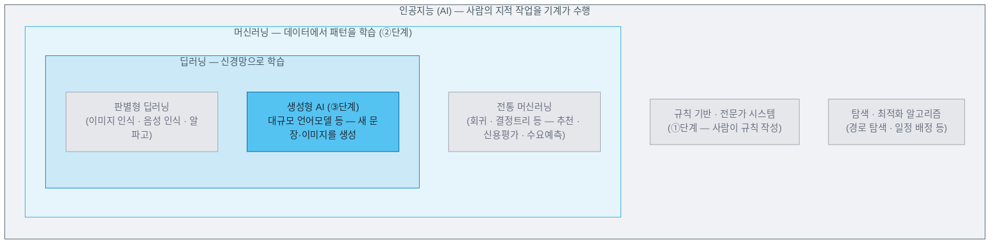

# 1주차 — 강의 안내 / AI란 무엇인가

> 경영경제 분야 AI 활용 입문 · 단국대학교
> **복습 기준 = 이 자료 + 수업 중 필기**

---

## 목차

- [0. 강의 안내](#0-강의-안내)
- [1. 1주차 개요 및 목표](#1-1주차-개요-및-목표)
- [2. 디지털 전환과 AI](#2-디지털-전환과-ai)
- [3. AI 발전 3단계](#3-ai-발전-3단계)
- [4. 확률 예측과 환각](#4-확률-예측과-환각)
- [5. BYOD 실습](#5-byod-실습)
- [6. AI의 종류와 실사례](#6-ai의-종류와-실사례)
- [7. 요약과 지문 비판](#7-요약과-지문-비판)

---

## 0. 강의 안내

### 0.1 이 과목의 목표

> **이번 학기의 목표는 AI(인공지능, Artificial Intelligence)를 활용해 시장·기업·경제 이슈나 사업 아이디어를 조사하고, AI의 답을 검증·해석하여 한 편의 분석보고서로 완성하는 능력을 갖추는 것입니다.**

총 네 단계로 구성되며, 각 단계는 15주 수업 로드맵을 기준으로 배치되어 있습니다.

| 단계 | 학습 성과 | 해당 블록 |
|:---:|---|---|
| ① 이해 | 생성형 AI의 작동 원리와 한계 이해 | Ⅰ. 리터러시 (1~3주) |
| ② 활용 | 프롬프트로 AI를 조사에 활용 · 기초 프레임(3C·SWOT·PEST 등) 적용 | Ⅱ. 조사·분석 (4~7주) |
| ③ 검증·해석 | AI 결과물의 비판적 검증·해석 | Ⅲ. 데이터·경제 (9~12주) |
| ④ 보고 | 검증 결과를 분석보고서로 종합 | Ⅳ. 종합 (13~14주) |

AI 활용의 윤리와 리스크(환각·편향·출처·보안)를 판단하는 능력은 특정 단계에 속하지 않고 네 단계 전반에 걸쳐 요구됩니다. 특히 보안은 회사·고객의 비공개 정보를 AI에 입력했다가 외부로 유출되는 위험을 뜻합니다. 3주에 기본 수칙으로 다루고 12주에서 심화합니다.

AI가 잘하는 일은 AI가 담당하고, AI가 하지 못하는 판단과 검증은 사람이 담당합니다. 이처럼 AI를 제대로 활용하는 방식을 익히는 것이 이번 학기의 주요 목표입니다.

### 0.2 이 과목이 다루지 않는 것

- 프로그래밍(Python 등) 코딩
- 웹 크롤링·API(Application Programming Interface)를 이용한 데이터 수집
- 통계 모형 구축·머신러닝 모델 개발

AI를 만들거나 프로그래밍하는 과목이 아니라, **이미 나와 있는 AI를 경영경제 문제에 활용하는 과목**입니다. 최종 제출물도 프로그램이 아니라 분석보고서입니다.

> [!IMPORTANT]
> 본 강의 수강을 위해 필요한 준비물은 **AI 계정**입니다. 실습은 **강의실 PC**로 진행하며, 개인 기기(스마트폰·태블릿·노트북)를 사용해도 됩니다. 이미 사용 중인 AI 계정이 있으면 그대로 쓰고, 없으면 학교 제공 무료 계정(Gemini)을 사용합니다.

### 0.3 15주 로드맵

| 블록 | 주차 | 내용 |
|---|:---:|---|
| Ⅰ. 리터러시 | 1~3주 | AI의 원리와 한계 → 프롬프트 기초 → AI 사용 수칙 |
| Ⅱ. 조사·분석 | 4~7주 | 시장조사 → 기업 읽기 → 분석 프레임(3C·SWOT·PEST) → 소비자 분석 |
| **중간고사** | **8주** | 지필시험 |
| Ⅲ. 데이터·경제 | 9~12주 | 데이터 분석 → 경제지표·뉴스 → 시각화 → 팩트체크 |
| Ⅳ. 종합 | 13~14주 | 아이디어·전략 검증 → 최종 분석보고서 완성 |
| **기말고사** | **15주** | 지필시험 |

### 0.4 평가

| 항목 | 비중 | 비고 |
|---|:---:|---|
| 중간고사 | 20% | 8주 — 1~7주 전 과정 |
| 기말고사 | 30% | 15주 — 전 과정 누적 |
| 과제물 | 30% | 학기 종합 과제 3회 (아래) |
| 발표 및 토론 | 10% | 매주 사례 공유(로테이션·저부담) |
| 출석 | 10% | |

- **학기 종합 과제 3회** — 하나의 주제를 3회에 걸쳐 완성합니다.
  - 과제 1 (4주 부여 → 6주 제출): 주제선정 + AI 3종 비교 — 6%
  - 과제 2 (7주 부여 → 10주 제출): 1차 조사·분석 — 9%
  - 과제 3 (11주 부여 → 14주 제출): 최종 분석보고서 — 15%
- **2-Track**: 4주에 **A. 기업·산업 분석** 또는 **B. 아이디어 검증** 중 하나를 선택해 학기 종합 과제로 진행합니다.

### 0.5 AI 도구 — 왜 Gemini인가

| 구분 | 도구 | 비고 |
|---|---|---|
| **권장 (학교 제공)** | Gemini + NotebookLM | **학교 제공 Google 계정(@dankook.ac.kr)** — 전원 보유·무료·데이터 보호. 시연은 이 계정으로 진행 |
| 비교 체험 | ChatGPT·Perplexity (무료) | 과제 1(4주)에서 3종 비교 |
| 교수 시연 확장 | Claude·Perplexity Pro | 교수 유료 계정 — **시연 전용**, 과제·평가에는 불필요 |

학교 계정 도구를 권장하는 이유는 세 가지입니다.

- 별도 가입·결제 불필요
- 학교 계정은 입력 데이터가 모델 학습에 사용되지 않도록 보호
- 교수 시연과 학생 화면이 동일한 환경

다만 **이미 사용 중인 AI 계정**(개인 Gemini·ChatGPT 등)이 있다면 그것을 계속 써도 됩니다. 시연은 학교 계정 Gemini로 진행하므로 화면 구성이 조금 다를 수 있다는 점만 감안하면 됩니다. 기기도 마찬가지입니다 — 실습은 강의실 PC로 진행하며, 개인 기기(스마트폰·태블릿·노트북)를 사용해도 됩니다.

유료 도구는 "이런 것도 가능하다"는 지평 확장용으로만 시연합니다. **여러분이 수행하는 사항들은 무료 도구만으로도 충분히 수행할 수 있습니다.**

### 0.6 수업 방식

매주 유사한 패턴으로 진행할 예정입니다.

| 구간 | 내용 |
|---|---|
| 도입 + 사례 공유 | 로테이션 발표(가볍게) |
| 강의 Ⅰ | 그 주의 개념 |
| 강의 Ⅱ + AI 시연 | 개념의 실연과 검증 |
| BYOD(Bring Your Own Device) 실습 + 검토 | **강의실 PC로 직접** — 개인 기기(스마트폰·태블릿·노트북) 사용도 가능 |
| 강의 Ⅲ — 심화·확장 | 심화 + 정리 |

이 자료는 수업에서 다룬 내용을 복습용으로 정리한 것입니다. 수업 중 추가로 설명한 내용은 각자 필기해 두시기 바랍니다.

AI 사용 수칙(과제 표기·기밀 금지 등)은 3주에 정식으로 다룹니다.

---

## 1. 1주차 개요 및 목표

1. 과목 구조(교수 시연 + BYOD + 사례 공유·2-Track 과제)와 최종 제출물(분석보고서)을 인지한다.
2. 생성형 AI의 작동 원리를 "다음 단어 확률 예측" 비유 수준으로 설명한다.
3. 환각(hallucination)이 발생하는 원리적 이유를 설명한다.
4. 수업에서 사용할 AI 계정(학교 계정 Gemini 또는 이미 사용 중인 계정)을 확인한다.

다음 주부터는 매주 도입 15분에 로테이션 방식으로 각자의 사례를 가볍게 공유합니다.

---

## 2. 디지털 전환과 AI

**학습목표** — 경영·경제 현장에서 AI가 이미 수행 중인 일을 영역별로 나열할 수 있다.

### 2.1 이미 경영 현장에 들어와 있는 AI

| 영역 | AI가 하는 일 |
|---|---|
| 마케팅 | 광고 문안·상품 설명 초안, 고객 세분화 |
| 고객 응대 | 챗봇 상담, 문의 분류·자동 회신 |
| 공급망·유통 | 수요예측, 자동 발주, 재고 최적화 |
| 금융 | 신용평가, 이상거래 탐지 |
| 인사(HR, Human Resources) | 이력서 스크리닝, 면접 일정 관리 |

이 중 세 가지(채용·신용평가·수요예측)는 6절에서 실제 케이스로 다룹니다.

> **자세히 보기 — 쿠팡의 상품 추천**
>
> 쿠팡 앱의 첫 화면은 사용자마다 다릅니다. 최근 검색·클릭·구매 이력을 학습한 추천 AI가 사람마다 다른 상품과 배열을 제시하기 때문입니다. "무엇을 구매할지"를 사람이 일일이 기획하는 것이 아니라, 축적된 행동 데이터에서 **다음에 구매할 만한 것**을 예측해 자동으로 배치합니다. 우리가 매일 쓰는 커머스 앱의 화면 자체가 AI의 결과물입니다.
> *(출처: 쿠팡 개인화 추천 시스템 공개 자료)*

### 2.2 함께 짚어보기 — 오늘 이미 사용한 AI

**Q**: 오늘 아침부터 지금까지, 여러분이 이미 사용한 AI를 하나만 말해 보세요.

**A**: 유튜브·인스타그램의 추천, 지도 앱의 도착 예측, 사진 앱의 얼굴 분류 — 대부분의 학생이 이미 여러 번 사용해 온 AI입니다. 다만 이들은 오늘 배울 생성형 AI와는 **종류가 다른 AI**입니다. 무엇이 다른지는 3.1(머신러닝과 생성형 AI의 차이)과 6절(실제 출력 화면)에서 구분합니다.

> [!TIP]
> "AI = 챗봇"이 아닙니다. 챗봇은 AI라는 큰 집합의 최신 구성원일 뿐입니다.

---

## 3. AI 발전 3단계

**학습목표**

- AI가 규칙 기반 → 머신러닝 → 생성형으로 발전해 온 흐름을 단계별로 설명할 수 있다.
- 오늘 다룰 생성형 AI가 이 흐름의 어디에 있는지 짚을 수 있다.
- 머신러닝과 생성형 AI의 관계(포함)와 차이(여섯 축)를 설명하고, 실제 사례를 두 종류로 구분할 수 있다.

| 단계 | 시기 | 작동 방식 | 대표 사례 | 한계 — 다음 단계가 나온 이유 |
|---|---|---|---|---|
| ① 규칙 기반 (전문가 시스템) | 1950~80년대 | 전문가의 판단 기준을 **사람이 if-then 규칙으로 직접 작성** | 초기 의료 진단 시스템·심사 규칙표·금지 단어 방식 스팸 필터 | 규칙이 수천 개로 불어나면 관리 불능, 예외·새로운 상황에 대응 불가 |
| ② 머신러닝 | 1990~2010년대 | 정답이 붙은 데이터에서 **기계가 패턴을 스스로 학습** | 스팸 필터·추천 알고리즘·신용평가·수요예측·알파고(2016) | 과업마다 별도 데이터와 별도 모델 필요, 출력은 점수·판정에 한정 |
| ③ 생성형 AI | 2017(기술 등장)~2022(대중화)~ | 초대형 텍스트로 사전학습한 모델이 **새로운 콘텐츠를 생성** | ChatGPT(2022)·Gemini·이미지 생성 | 환각(4.2)·지식의 시간 한계(2주) — 그래서 이 과목은 검증을 훈련 |

세 단계를 관통하는 변화는 한 가지입니다 — **사람이 하던 일이 한 층씩 기계로 이동합니다.** 규칙 기반에서는 사람이 규칙을 만들었고, 머신러닝에서는 사람이 정답 데이터를 주면 기계가 패턴을 찾았으며, 생성형에서는 과업마다 모델을 새로 만들 필요조차 줄었습니다. 바둑 한 가지를 위해 만들어진 알파고(2016)가 ②단계의 정점이라면, 하나의 모델로 번역·요약·작문을 모두 수행하는 ChatGPT(2022)는 ③단계의 출발점입니다.

단계가 올라갈수록 사람이 규칙을 작성하는 일은 줄고, **데이터가 결과를 결정하는 비중**이 커집니다. 오늘 우리가 다룰 대상이 이 마지막 ③단계 — 생성형 AI입니다. 그것이 ②단계와 어떻게 다른지를 먼저 정리하고, 실제로 어떻게 답을 만드는지는 4절에서 다룹니다.

### 3.1 머신러닝과 생성형 AI — 무엇이 같고 무엇이 다른가

위 표는 세 단계를 시기순으로 나란히 두었지만, ②와 ③은 별개의 기술이 아닙니다. **생성형 AI는 머신러닝 밖에서 나온 새 기술이 아니라 머신러닝의 최신 갈래**입니다. 포함 관계로 정리하면 다음과 같습니다.



회색으로 표시한 규칙 기반 시스템도 AI입니다 — 규칙을 **사람이 썼는가, 데이터에서 학습했는가**가 ①과 ②의 경계입니다. 생성형 AI도 데이터에서 패턴을 학습한다는 점에서는 머신러닝과 같습니다. 다른 것은 **무엇을 학습해 무엇을 내놓는가**입니다.

> [!IMPORTANT]
> 머신러닝(예측형)은 **데이터를 받아 판정을 내고**, 생성형 AI는 **학습한 분포에서 지시에 맞는 데이터를 새로 만들어 냅니다** — 입력과 출력의 방향이 반대입니다.

**②단계 머신러닝과 ③단계 생성형 AI의 차이 — 여섯 축**

| 축 | ② 머신러닝 (예측형 용도) | ③ 생성형 AI |
|---|---|---|
| 목적 | 판별·분류·예측 — "이 입력은 어느 쪽인가" | 생성 — "이 지시에 맞는 새 결과물" |
| 학습 데이터 | 과업별로 **정답이 붙은 데이터**(스팸/정상 · 승인/거절) | **정답 표시 없는 대규모 텍스트·이미지**를 사전학습 |
| 모델의 범위 | 과업 하나에 모델 하나 — 스팸 필터는 신용평가를 못 함 | 모델 하나로 번역·요약·작문·분석 |
| 출력 | 점수·등급·판정 — 정해진 양식 · 같은 입력에 같은 출력 | 문장·표·이미지 — 정해진 양식 없음 · 실행마다 조금씩 다름 |
| 사용 방식 | 개발자가 데이터를 모아 **학습시킴** — 사용자는 결과만 받음 | 사용자가 **말로 지시**(프롬프트) — 별도 학습 없이 바로 사용 |
| 오류의 형태 | 오분류·편향(6.2 아마존 사례) | **환각**(4.2) — 없는 사실을 그럴듯하게 생성 |

다섯째 행이 이 과목의 위치를 정합니다. 머신러닝 시대에는 AI를 활용하려면 데이터와 개발자가 필요했고, 경영경제 전공자가 직접 다룰 여지가 적었습니다. 생성형 AI는 **언어로 지시하는 것**이 곧 사용법이므로, 프롬프트(3주)와 검증(학기 전체)이 이 과목의 내용이 됩니다.

여섯째 행은 오류의 성격이 다르다는 뜻입니다. 머신러닝은 학습 데이터가 편향되면 판정이 편향되고(6절 실사례), 생성형 AI는 사실이 없는 자리에도 문장을 채웁니다(4절). 대응도 다릅니다 — 전자는 데이터를 점검하고, 후자는 출력을 검증합니다.

넷째 행의 출력이 실행마다 달라지는 것은 확률로 생성하기 때문이고(4.1), 문장뿐 아니라 이미지·음성까지 다루는 것은 텍스트·이미지·음성을 함께 학습한 **멀티모달(multimodal)** 모델이기 때문입니다 — 두 현상의 원인이 다르며, 후자는 2주에서 다룹니다.

**같은 회사 안의 두 AI** — 2.1의 쿠팡 사례를 다시 살펴보면 두 종류가 나란히 있습니다.

| | 상품 추천 | 상품 설명 초안 |
|---|---|---|
| 종류 | ② 머신러닝(예측형) | ③ 생성형 AI |
| 입력 → 출력 | 검색·클릭·구매 이력 → **구매 확률 점수** → 점수 순 배치 | "이 상품의 설명을 써 줘" → **새 문장** |
| 오류가 나면 | 관심 없는 상품이 상위에 노출됨 | 없는 기능이 설명에 들어감 |

### 3.2 함께 짚어보기 — 예측형인가, 생성형인가

**Q**: 다음 네 가지는 각각 ② 머신러닝(예측형)과 ③ 생성형 AI 중 어느 쪽에 해당할까요? 판정의 근거는 무엇일까요?

① 이메일 스팸 필터 ② 이력서 자동 스크리닝 ③ 회의록 3줄 요약 ④ 편의점 수요예측

**A**: ①②④는 머신러닝(예측형), ③은 생성형입니다. 판정의 근거는 **출력의 형태**입니다 — 스팸/정상, 합격/불합격, 예상 판매량은 모두 **정해진 형식의 판정·수치**이고, 요약문은 **그 자리에서 새로 만든 문장**입니다. 출력이 무엇인지를 확인하는 것이 가장 빠른 구분법이며, 6절에서 실제 출력 화면으로 다시 확인합니다.

용어를 하나로 연결해 둡니다 — 이 과목에서 **예측형 AI**라고 부르는 것이 곧 ②단계 머신러닝의 대표 용도입니다. 3절(발전 단계)·4절(기존 AI)·6절(예측형)은 같은 대상을 다른 각도에서 부르는 이름입니다.

---

## 4. 확률 예측과 환각

**학습목표**

- 생성형 AI의 답변 생성 원리를 확률 예측 비유로 설명할 수 있다.
- 환각이 "가끔 나는 오류"가 아니라 원리에서 비롯되는 구조적 현상임을 설명할 수 있다.

3.1에서 정리한 대로, ③단계 생성형 AI가 ②단계 머신러닝과 결정적으로 다른 점은 출력입니다 — 기존 AI가 정해진 답을 '고르고 판정한다'면, 생성형 AI는 문장·이미지를 '새로 만들어 낸다'는 것입니다. 두 종류의 실제 출력 화면은 6절에서 비교하고, 여기서는 먼저 생성형 AI가 답을 만드는 원리부터 살펴봅니다.

> [!TIP]
> **"일반 AI"라는 용어에 주의**
>
> "일반 AI"는 두 가지 뜻으로 쓰입니다. ① 일상에서는 추천·예측처럼 정해진 작업을 하는 **기존 AI**를 가리키고, ② 뉴스·학계에서는 **AGI(일반 인공지능, Artificial General Intelligence)** — 인간처럼 분야를 가리지 않고 스스로 배우고 판단하는 AI — 를 뜻합니다. AGI는 아직 실현되지 않은 목표입니다.
>
> 지금의 생성형 AI(ChatGPT·Gemini)는 AGI가 아닙니다. 그럴듯한 글은 잘 만들지만, 스스로 목표를 세우거나 배우지 않은 분야를 독학하지는 못하고, 글자 수 세기 같은 단순 작업을 틀리기도 합니다. 예컨대 장문의 보고서는 막힘없이 작성하면서도 "이 문장이 몇 글자인지"는 부정확하게 답하곤 합니다 — 겉보기의 유창함과 실제 이해력은 다르며, 이 수업이 검증을 강조하는 이유입니다.

### 4.1 생성형 AI는 어떻게 답을 만드나

"옛날 옛날에 ______" — 빈칸에 무엇이 올까요? 대부분의 사람이 "호랑이가"나 "한 소녀가"를 떠올립니다.

생성형 AI가 하는 일이 정확히 이것입니다. **지금까지의 글에 이어서 가장 그럴듯한 다음 단어를 확률로 고르고, 그것을 수없이 반복**합니다. 방대한 텍스트에서 "어떤 말 뒤에 어떤 말이 자주 오는가"의 패턴을 학습했기 때문에 가능한 일입니다.

수식은 필요 없습니다 — 이 비유 하나로 이번 학기에 다루는 주요 현상 대부분을 설명할 수 있습니다.

### 4.2 그럴듯한 오답 — 환각의 구조적 이유

AI는 "사실을 조회"하는 것이 아니라 "그럴듯한 문장을 생성"합니다. 그래서 AI는 **모르는 것을 질문받아도 침묵하는 대신, 그럴듯한 답을 생성합니다.** 이것이 환각(hallucination)입니다.

> [!IMPORTANT]
> 환각은 버그가 아니라 **작동 원리에서 비롯되는 필연적 결과**입니다. "그럴듯한 다음 단어"를 고르는 방식은, 사실이 없는 자리에서도 그럴듯함을 만들어 냅니다. 그래서 이 과목에서는 AI 사용법이 아니라 **검증법**을 배웁니다.

### 4.3 이 과목이 검증을 다루는 이유

AI에게 잘 물어보는 법(프롬프트 — 3주)만큼, **AI의 답을 비판적으로 검토하는 법**(출처 확인·교차 검증·수치 검산 — 학기 전체)을 배웁니다.

### 4.4 시연 ① — 첫 조사 과업: AI를 활용한 시장조사

**프롬프트 원문** (Gemini·학교 계정·기본 모드)

```
너는 시장조사 애널리스트야. 국내 저가 커피 프랜차이즈 시장
(메가커피·컴포즈커피 등)을 조사해줘.
① 시장 규모와 최근 3년 성장 추이 ② 주요 브랜드별 매장 수와 순위
③ 성장 원인 3가지를 표로 정리하고, 각 수치의 출처를 함께 밝혀줘.
```

**실행결과** — 2026-07-09 실행분입니다. 생성형 AI의 답변은 실행 시점·계정에 따라 달라지므로, 수업에서 다시 실행하면 수치와 구성이 바뀔 수 있습니다.

| 항목 | 답변 내용 | 출처 표기 |
|---|---|---|
| 시장 개요 | 매장 수 10만 개 · 연매출 15조 원 | 없음 |
| 가맹점 매출 | 2024년 가맹점 평균 매출, 전년 대비 8.3% 증가 | 공정거래위원회 「2025 가맹사업 현황통계」 |
| 매장 수 순위(2024) | 메가MGC커피 3,325 · 컴포즈커피 2,649 · 이디야커피 2,562 · 빽다방 1,712 · 투썸플레이스 1,510 | 공정거래위원회 발표 인용 |
| 결제액·점유율(2024-09) | 메가커피 639억 원(43.7%) · 컴포즈커피 26% · 빽다방 17% | 아이지에이웍스, "픽플라이 분석" 병기 |
| 성장 원인 | 가성비 수요 · 접근성 · 품질 상향 평준화 | 항목별로 다름 |

요구한 대로 표 형식으로 정리되었고, 출처 열도 포함되어 있습니다. 질문 하나로 이 정도의 조사 결과가 나왔습니다.

**점검포인트** — 이 답변에서 함께 확인할 다섯 가지

1. 가장 큰 수치(10만 개 · 15조 원)에 출처가 제시되어 있습니까.
2. 인용된 출처는 실재합니까. 실재한다면 그 자료에 이 수치가 실제로 있습니까.
3. 매장 수 순위에 스타벅스가 없는 이유는 무엇입니까.
4. 점유율의 분모는 무엇입니까. 43.7 + 26 + 17 = 86.7%이며, 나머지는 누구입니까.
5. 기준 시점이 통일되어 있습니까(2024년 9월 결제액 · 2024년 매장 수 · 2025년 발표 자료).

<details>
<summary><b>확인된 사항 보기</b></summary>

- **일치하는 부분** — 순위 구조(메가 > 컴포즈 > 이디야 · 빽다방 > 투썸)와 결제액은 실제 자료와 일치합니다. 저가 커피 5개 브랜드의 2024년 9월 결제액 합계 1,462억 원에 43.7%를 적용하면 약 639억 원이 되어 답변의 수치와 일치하며, 인용된 아이지에이웍스도 실재하는 조사 기관입니다.
- **부정확한 부분 ① 2차 재인용** — 함께 적힌 "픽플라이(픽플리)"는 실재하는 소비자 설문 서비스(㈜알투씨컴퍼니)이지만, 인용된 수치는 그 자료에 없습니다. 원출처는 아이지에이웍스(모바일인덱스)이며, 픽플리는 그것을 다시 인용한 2차 자료입니다.
- **부정확한 부분 ② 근거 없는 수치** — "10만 개 · 15조 원"은 답변에서 가장 큰 수치인데 출처가 없습니다.
- **설명이 필요한 부분** — 스타벅스가 순위에 없는 것은 가맹사업 통계가 가맹 브랜드만 집계하기 때문입니다(스타벅스는 직영 운영). 답변이 틀린 것이 아니라 통계의 범위가 그렇습니다.

</details>

> [!IMPORTANT]
> 출처 확인은 세 층입니다 — ① 그 출처가 실재하는가 ② 그 자료에 이 수치가 있는가 ③ 그것이 1차 자료인가.
>
> 정확한 내용과 부정확한 내용이 한 답변 안에 함께 있습니다. **확인하기 전에는 어느 쪽인지 구분할 수 없습니다.**

### 4.5 시연 ② — 환각 유도: 실존 권위에 허구 개념 질의 (단계별 검증)

**프롬프트 원문** (Gemini·동일 환경)

```
피터 드러커가 제시한 '고객가치 3의 법칙'을 설명하고,
실제 기업 사례를 들어 어떻게 적용하는지 알려줘.
```

**실행결과** — 2026-09-01 실행분입니다. 생성형 AI의 답변은 실행 시점·계정에 따라 달라지므로, 수업에서 다시 실행하면 답변이 바뀔 수 있습니다.

AI는 **답변을 거부하지도 않았고**("그런 개념은 확인되지 않는다"는 응답), **존재하지 않는 법칙을 통째로 새로 생성하지도 않았습니다.** 대신 질문의 전제를 바꾸어, 드러커의 실재하는 다른 개념으로 답했습니다.

- 먼저 드러커의 **실재하는 저서** 『최고의 질문(The Five Most Important Questions)』을 근거로 끌어왔습니다.
- 이어 *"질문하신 내용은 보통 드러커가 강조한 '조직을 살리는 3가지 핵심 질문(미션·고객·고객가치)'의 맥락으로 이해할 수 있습니다"*라고 적었습니다.
- 그리고 ① 미션 ② 고객 ③ 고객가치를 "3가지 축"으로 정리한 뒤, 적용 사례로 애플(사양이 아니라 창의성과 경험을 판다)과 질레트(본체는 저렴하게, 면도날에서 수익)를 들었습니다.
- 대화 제목도 "피터 드러커의 고객가치 3의 법칙과 사례"로 자동 생성되었습니다.

사례로 든 내용 자체는 대체로 사실입니다. 그래서 읽는 동안에는 이상한 점이 잘 보이지 않습니다.

**점검포인트** — 이 답변에서 함께 확인할 네 가지

1. AI가 **"그런 개념은 확인되지 않습니다"라고 말했습니까.** 말하지 않았다면 그것이 첫 번째 문제입니다 — 내용의 진위를 따지기 전에, **없는 것을 없다고 하지 않은 것**입니다.
2. 근거로 든 저서는 실재합니까. 실재한다면 그 책의 내용을 정확히 옮겼습니까.
3. 대화 제목은 누가 정했습니까. 그 제목만 보면 이 개념은 실재하는 것처럼 보입니다.
4. 사례가 사실이라는 것과, 질문한 개념이 실재한다는 것은 같은 말입니까.

<details>
<summary><b>확인된 사항 보기</b></summary>

- **저서는 실재하지만, 질문의 수에 맞추어 잘렸습니다.** 『최고의 질문』의 정본은 미션·고객·고객가치·**결과·계획**의 **다섯 질문**입니다. 답변은 그중 셋만 골라 "3가지 축"으로 제시했습니다. 질문에 있던 "**3**"이라는 수에 답을 맞춘 것입니다 — 4.1절의 확률 예측이 그대로 나타난 지점입니다.
- **이름이 비슷한 실재 개념도 있습니다.** "3의 법칙(Rule of Three)"은 실제로 있는 개념이지만 드러커의 것이 아니며(Bruce Henderson에서 출발해 Sheth·Sisodia가 정리), 내용도 고객가치가 아니라 **성숙한 시장은 주요 3사로 수렴한다**는 시장 구조 이론입니다.
- **'고객가치 3의 법칙'은 공개된 자료에서 확인되지 않습니다.** 다만 이것은 "찾지 못했다"는 뜻이지 "존재하지 않는다"의 증명은 아닙니다. 이 구분 자체가 검증의 일부입니다.

</details>

> [!IMPORTANT]
> 환각에는 층이 있습니다 — ① 없는 내용을 새로 생성하기 ② 실재하는 개념을 다른 사람에게 귀속시키기 ③ **질문의 전제를 바꾸어 그럴듯하게 답하기.**
>
> 뒤로 갈수록 위험합니다. **내용의 대부분이 사실이어서, 확인해 볼 동기가 생기지 않기 때문입니다.**

### 4.6 시연 ③ — 같은 질문, 다른 답 (비결정성)

**프롬프트 원문** (Gemini·**새 대화 2개**에서 동일하게 실행)

```
국내 저가 커피 프랜차이즈 시장의 성장 원인을 3가지만 꼽아줘.
```

**실행결과** — 2026-09-01, 새 대화 두 곳에서 같은 질문을 실행한 결과입니다. 실행 시점·계정에 따라 달라지므로, 수업에서 다시 실행하면 답변이 바뀔 수 있습니다.

| 순서 | 1회차 | 2회차 |
|:---:|---|---|
| 첫째 | 고물가 시대의 '가성비' 소비 트렌드 확산 | 고물가 시대의 '가성비(가격 대비 성능)' 소비 트렌드 확산 |
| 둘째 | 접근성과 테이크아웃 중심의 매장 전략 | **상향 평준화된 품질과 메뉴 경쟁력** |
| 셋째 | 품질 개선과 메뉴 다변화 | **공격적 출점을 통한 접근성·테이크아웃 문화** |
| 그 밖 | 말미에 원두 가격·환율 상승 참고 문단 | 생두 직수입·물류 효율화, 코로나19 키오스크 언급 · **출처 표시 1건** |

둘째와 셋째의 순서가 서로 바뀌었고, 부연에 등장한 소재가 달라졌으며, **출처는 2회차에만 제시되었습니다.**

**점검포인트** — 두 답을 나란히 놓고 확인할 것

1. 두 답에서 **같았던 것**은 무엇이고, **달라진 것**은 무엇입니까.
2. 순서가 바뀐 것은 앞의 항목이 더 중요하다는 뜻입니까.
3. 출처가 한 번만 제시된 것은 무엇을 뜻합니까.

<details>
<summary><b>확인된 사항 보기</b></summary>

- **뼈대는 같고 세부가 달랐습니다.** 세 가지 원인(가성비 · 품질 · 접근성)은 두 번 다 나왔습니다. 달라진 것은 순서와 표현, 부연으로 붙는 소재, 그리고 출처의 유무입니다.
- **널리 다뤄진 주제일수록 큰 답은 안정적으로 반복됩니다.** 이 주제는 관련 자료가 많아 결론이 수렴합니다. 자료가 드문 주제일수록 답의 편차는 커집니다(다음 주에 다룹니다).
- **그런데 과제에 옮겨 적는 것은 대개 세부입니다** — 수치 · 사례 · 출처. 매번 달라지는 부분이 정확히 그 부분입니다.

</details>

> [!IMPORTANT]
> AI의 답은 정해진 정답을 찾아온 것이 아니라, 그럴듯한 여러 답 가운데 하나입니다.
>
> **뼈대는 비슷해도 인용할 만한 세부는 매번 달라집니다.** 중요한 질문은 다시 묻거나, 다르게 묻거나, 다른 도구로 확인합니다.

---

## 5. BYOD 실습

### 5.1 실습 절차

1. 강의실 PC에서 **gemini.google.com** 접속 (개인 기기는 Gemini 앱도 가능)
2. **학교 Google 계정(@dankook.ac.kr)** 으로 로그인 — 이미 사용 중인 AI 계정이 있으면 그 계정으로 진행해도 됩니다
3. 관심 있는 기업·시장에 대해 자유롭게 한 가지 질문
4. 받은 답변에서 **"그럴듯하지만 확인되지 않은 것" 1개**를 찾아 표시

### 5.2 검토 포인트

**"그럴듯하지만 확인되지 않은 것"의 후보**

- 출처 없는 수치
- "업계 1위" 같은 단정
- 기준 연도가 없는 통계
- 실재 여부를 알 수 없는 보고서 인용

**"답을 받으면 확인이 필요한 항목 1개 찾기"** — 이 한 가지 습관을 첫날부터 시작합니다. 15주 뒤 최종 보고서의 "검증 기록"이 이 습관의 누적입니다.

---

## 6. AI의 종류와 실사례

**학습목표**

- 예측형 AI와 생성형 AI를 출력 형태와 용도로 구분할 수 있다.
- 경영 현장의 AI 실사례에서 "어디에 AI가 활용되었고 무엇이 문제였는가"를 지적할 수 있다.

### 6.1 예측형 vs 생성형 — 출력이 다르다

3.1에서 여섯 축으로 대비한 두 종류를, 여기서는 **실제 출력 화면**으로 확인합니다. 예측형 AI는 3절의 ②단계 머신러닝을 그 대표 용도로 부르는 이름입니다.

| 구분 | 예측형 AI (Predictive — ②단계 머신러닝) | 생성형 AI (Generative — ③단계) |
|---|---|---|
| 하는 일 | 과거 데이터의 패턴으로 **판별·점수·예측** | 학습한 패턴으로 **새로운 콘텐츠 생성** |
| 입력 → 출력 | 데이터 → **수치·등급·판정** (정해진 양식) | 질문·지시 → **문장·표·이미지** (정해진 양식 없음) |
| 대표 예 | 스팸 필터·추천 알고리즘·신용평가·수요예측 | 챗봇(Gemini 등)·문안 생성·요약·이미지 생성 |
| 학술 용어 | 판별 모델(Discriminative) — "입력이 주어졌을 때 정답일 확률"을 학습 | 생성 모델(Generative) — 데이터의 분포 자체를 학습해 새 데이터를 생성 |

**실제 출력 형태 ① — 예측형** (신용평가 시스템의 심사 결과 화면, 설명용 구성 예)

```
신청 번호: 2026-081234
신용 점수: 712 / 1000  |  등급: B+  |  판정: 승인 권장
12개월 내 부도 확률: 2.4%
주요 판단 요인:
  (+) 최근 6개월 연체 이력 없음
  (−) 신용카드 한도 사용률 74%
  (−) 보유 대출 3건
```

출력이 **점수·등급·확률·판단 요인**으로 정해져 있습니다. 형식 밖의 새로운 내용은 만들지 않으며, 같은 입력에는 같은 출력이 나옵니다.

**실제 출력 형태 ② — 생성형** (같은 은행의 상담 챗봇에 "내 대출 조건을 요약해줘", 설명용 구성 예)

```
고객님의 신용 대출 조건을 요약해 드리겠습니다. 현재 예상 한도는 약
3,000만 원이며, 금리는 신용 등급에 따라 연 5.2%~6.8% 범위에서 결정
됩니다. 최근 6개월간 연체 이력이 없어 우대 금리 적용 대상입니다. 다만
신용카드 사용률이 다소 높은 편이므로, 사용률을 낮추시면 다음 심사에서
더 유리한 조건을 기대할 수 있습니다. 더 궁금하신 점이 있으면 말씀해
주세요.
```

출력이 **그 자리에서 새로 생성되는 문장**입니다. **정해진 양식이 없어** 문장·표·목록 등 지시에 따라 형태가 달라지고, 같은 질문에도 실행마다 표현이 조금씩 달라집니다(4.6 시연 ③의 원리). 예측형의 점수를 재료로 삼아 사람이 읽을 문장으로 바꿔 주는 관계이기도 합니다.

2절에서 여러분이 답한 추천·예측 AI는 대부분 **예측형**입니다. 이번 학기의 중심 대상은 생성형 AI이지만, AI 활용에 대한 문제들은 예측형에서 먼저 발생했습니다.

### 6.2 실사례 ① — 아마존 AI 채용 도구 폐기 (2018)

아마존은 이력서를 자동 평가하는 AI를 개발했으나, **여성 관련 표현이 들어간 이력서를 감점**하는 편향이 발견되어 도구를 폐기했습니다. 원인은 학습 데이터 — 과거 10년간의 채용 이력이 남성 편중이었고, AI는 그 패턴을 그대로 학습했습니다. *(출처: Reuters, 2018-10-10 보도 — Jeffrey Dastin)*

**Q**: AI가 차별을 "만들어 낸" 것일까요, "배운" 것일까요?

**A**: 배운 것입니다. AI는 과거 데이터의 패턴을 학습해 미래를 예측합니다 — **과거 데이터가 편향되어 있으면 예측도 편향됩니다.** "AI가 결정했으니 객관적"이라는 통념이 무너지는 지점이며, 데이터를 보는 눈이 곧 경영의 눈이 되는 이유입니다.

### 6.3 실사례 ② — Apple Card 신용한도 논란 (2019~2021)

Apple Card 출시 직후, 부부가 재산을 공유하는데도 **남편의 신용한도가 아내의 수십 배**라는 문제 제기가 이어져 뉴욕주 금융당국(NYDFS, New York State Department of Financial Services)이 조사에 들어갔습니다. 2021년 결론은 **공정대출법 위반은 발견되지 않음**이었으나, 한도 산정 기준을 고객에게 설명하지 못하는 **불투명성**이 문제로 지적됐습니다.

**Q**: 법 위반이 없었음에도 이 사건이 여전히 "실패 사례"로 불리는 이유는 무엇일까요?

**A**: 신뢰의 실패이기 때문입니다. 알고리즘이 왜 그런 결정을 했는지 **회사 스스로 설명하지 못하면**, 결과가 합법이어도 고객과 규제당국의 신뢰를 잃습니다. "설명할 수 없는 AI 결정" 자체가 경영 리스크입니다. 그래서 AI 결정의 근거를 사람이 이해할 수 있는 형태로 제시하려는 흐름을 **설명가능 AI(XAI, eXplainable AI)** 라고 부릅니다. 이 주제는 12주 윤리·리스크에서 다시 다룹니다.

### 6.4 실사례 ③ — 유통업의 AI 수요예측·자동 발주 (성공 사례)

국내 유통·편의점 업계는 판매 데이터·날씨·행사 정보로 **수요를 예측해 자동 발주**하는 AI의 도입을 확대하고 있습니다. 유통기한이 짧은 신선식품의 폐기를 줄이고 결품(품절)을 방지해, 점포 운영의 표준 도구로 정착하고 있습니다. *(출처: ZDNet Korea 2026-08 보도 — 편의점 3사 AI 발주·운영 도입 확대, 세븐일레븐 AI 운영관리자 2024년 도입)*

**Q**: 앞의 두 사례가 논란이 된 반면, 이 사례가 성공으로 평가받는 이유는 무엇일까요?

**A**: 예측 대상과 오류 비용의 구조가 다릅니다 — 사람(채용·신용)이 아닌 **판매량**을 예측하고, 틀려도 폐기·결품이라는 **회복 가능한 비용**에 그치며, 결과를 매일 실적으로 검증할 수 있습니다. AI 도입의 성패는 기술이 아니라 **"어디에 쓰는가"** 에 달려 있습니다. 이 기준은 14주 AI 도입 판단 프레임에서 정식으로 다룹니다.

### 6.5 더 알아보기

**토큰 개념** — AI는 글자가 아니라 토큰(단어 조각) 단위로 텍스트를 처리합니다. AI가 "글자 수 세기" 같은 단순 과제를 의외로 틀리는 이유이며, 같은 문장도 언어에 따라 토큰 수가 다릅니다(한국어 > 영어).

**AI가 잘하는 작업과 그렇지 못한 작업** — 확률 예측 원리에서 그대로 도출됩니다. 잘하는 작업은 요약·초안 작성·번역·형식 변환·아이디어 나열처럼 **패턴이 풍부한 일**이고, 정확도가 떨어지는 작업은 최신 사실 확인·정확한 수치·계산·출처 특정처럼 **정확성이 요구되는 일**입니다. 다음 주에는 이 한계를 종류별로 나눠 다룹니다.

**자주 나오는 질문 — AI를 쓰면 표절인가** — 도구를 쓰는 것 자체는 문제가 되지 않습니다. 문제가 되는 것은 **AI가 만든 결과를 검증도 표기도 없이 자기 글처럼 제출하는 경우**입니다. 이 과목은 AI 활용을 전제로 하되 **활용 표기와 검증 기록**을 요구하며, 상세 수칙은 3주에 다룹니다. 다른 수업에서는 그 수업의 기준을 별도로 확인하시기 바랍니다.

**국내 기업의 생성형 AI 도입 — 삼성전자** — 삼성전자는 2026년 6월 ChatGPT·Gemini·Claude 세 가지 외부 생성형 AI를 사내 업무에 공식 도입했고, 8월까지 전 관계사 임원 약 2,300명을 대상으로 AI 교육을 진행했습니다. 주목할 점은 **같은 회사가 2023년에는 사내 사용을 금지했다는 것**입니다 — 직원이 업무 소스코드를 ChatGPT에 입력해 정보가 유출된 일이 계기였습니다. 3년 만에 금지에서 전면 도입으로 방향이 바뀌었고, 그사이 달라진 것은 AI의 성능만이 아니라 **무엇을 입력해도 되는지에 대한 회사의 기준**이었습니다. 이 기준은 3주 AI 사용 수칙에서 다룹니다. *(출처: CIO Korea 2026-06-12 보도 · 삼성전자 뉴스룸 보도자료)*

---

## 7. 요약과 지문 비판

### 7.1 오늘의 요약

- 이 과목 = AI로 경영경제 문제를 **조사·검증·해석·보고**하는 훈련
- 머신러닝(예측형) = **데이터 → 판정** / 생성형 AI = **지시 → 새 데이터** — 생성형은 머신러닝의 최신 갈래이며, 입력과 출력의 방향이 반대
- 생성형 AI = **다음 단어를 확률로 예측하는 방식** — 사실 조회가 아니므로 **환각은 구조적 현상**
- 편향된 과거 데이터 → 편향된 예측 (아마존)
- 합법이어도 설명하지 못하면 신뢰를 잃음 (Apple Card)
- AI 도입의 성패는 "어디에 쓰는가"에 달림 (수요예측)
- 오늘 시작한 습관 = **답을 받으면 확인이 필요한 항목 1개 찾기**

### 7.2 AI 지문 비판

**문항 1** — 다음은 AI가 생성한 문단입니다. 문제점을 2개 이상 지적해 보세요.

> "국내 편의점 산업은 2025년 총매출 87조 원으로 세계 1위 규모다. 한국AI경영학회의 최근 조사에 따르면 국내 편의점의 94%가 이미 생성형 AI 발주 시스템을 도입했으며, 전문가들은 AI 도입 점포의 매출이 평균 40% 증가했다고 입을 모은다."

<details>
<summary><b>문항 1 정답 및 해설 보기</b></summary>

① **출처 불명의 단정** — "세계 1위 규모"는 비교 기준(국가별? 인구당?)과 출처가 없습니다.
② **존재가 확인되지 않는 기관·통계** — "한국AI경영학회의 조사"와 "94%"는 실재 여부부터 검증 대상입니다.
③ **익명의 권위** — "전문가들은 입을 모은다"는 검증 불가능한 인용이며, "매출 40% 증가"는 원인(AI 도입)과 결과를 단정하고 있습니다.

**통찰**: 그럴듯한 수치와 권위가 촘촘할수록, 먼저 물어야 합니다 — "이 출처는 실재하는가?"

</details>

**문항 2** — 다음 문단은 실재하는 출처만 인용하고 있습니다. 그래도 문제점을 2개 이상 지적해 보세요.

> "공정거래위원회 '2025 가맹사업 현황통계'에 따르면 국내 커피 프랜차이즈 매장 수 1위는 메가MGC커피로, 스타벅스를 제치고 업계 1위에 올랐다. 같은 통계에서 국내 저가 커피 시장 규모는 연 3조 2천억 원으로 집계됐다. 또한 소비자 조사 플랫폼 픽플리의 분석에 따르면 저가 커피 결제액 점유율은 메가커피가 43.7%로 1위다."

<details>
<summary><b>문항 2 정답 및 해설 보기</b></summary>

① **집계 범위의 착시** — 가맹사업 통계는 가맹 브랜드만 집계하므로 직영 체제인 스타벅스는 애초에 명단에 없습니다. "스타벅스를 제치고"는 통계가 말하지 않는 해석입니다.
② **원문에 없는 수치** — "시장 규모 연 3조 2천억 원"은 해당 통계의 집계 항목이 아닙니다. 실재하는 출처 뒤에 근거 없는 수치가 더해져 있습니다.
③ **2차 재인용** — 점유율 43.7%의 원출처는 아이지에이웍스(모바일인덱스) 데이터이며, 픽플리는 이를 옮겨 실은 곳입니다. 수치가 맞더라도 인용은 부정확합니다.

**통찰**: 출처가 실재해도 세 가지를 더 물어야 합니다 — 그 수치가 원문에 있는가, 1차 출처인가, 무엇을 집계한 통계인가.

</details>

---

**다음 주** — AI가 아는 것과 모르는 것: 학습 데이터와 지식의 시간 한계, 검색 결합의 차이
