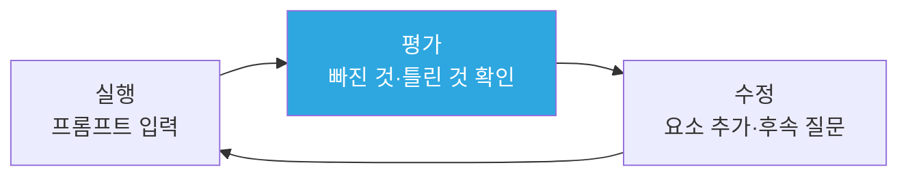

# 3주차 — 프롬프트 기초와 AI 사용 수칙

> 경영경제 분야 AI 활용 입문 · 단국대학교
> **복습 기준 = 이 자료 + 수업 중 필기**

## 목차

- [1. 3주차 개요 및 목표](#1-3주차-개요-및-목표)
- [2. 프롬프트 설계 — 4요소와 반복 개선](#2-프롬프트-설계--4요소와-반복-개선)
- [3. 조별 실습 1~3 — 요소를 더하며 비교](#3-조별-실습-13--요소를-더하며-비교)
- [4. 조사 프롬프트 틀과 AI 사용 수칙](#4-조사-프롬프트-틀과-ai-사용-수칙)
- [5. 조별 실습 4~6 — 조사 틀과 출처 확인으로 비교](#5-조별-실습-46--조사-틀과-출처-확인으로-비교)
- [6. 심화·확장 〔자습〕](#6-심화확장-자습)
- [7. 요약과 AI 지문 비판](#7-요약과-ai-지문-비판)

---

## 1. 3주차 개요 및 목표

### 1.1 이번 주 학습 목표

1. 프롬프트 엔지니어링의 개념을 설명하고, 에이전트·오케스트레이션으로 확장되는 흐름에서 사람이 담당하는 일과 AI가 담당하는 일을 구분한다.
2. 프롬프트 4요소(역할·맥락·단계·예시)로 AI에게 할 질문을 설계한다.
3. 반복 개선(후속 질문)으로 답변의 품질을 높인다.
4. AI 사용 기본 수칙(초안 전제·출처 확인·AI 활용 표기·기밀·개인정보 입력 금지)을 자기 과제에 적용한다.
5. 조별 실습에서 같은 프롬프트의 응답을 비교하고, 답이 달라진 지점과 확인되지 않은 지점을 기록한다.

1주에는 AI가 답을 만드는 원리를, 2주에는 AI가 아는 것과 모르는 것의 경계를 확인했습니다. 오늘은 초점을 AI에서 사용자로 옮겨, 같은 AI에게서 더 정확하고 유용한 답을 얻도록 **질문을 설계하는 방법**을 다룹니다. 다음 주 과제 1이 시작되므로, 오늘 배우는 틀과 수칙이 과제 수행의 기초가 됩니다.

### 1.2 이번 주 진행 순서

오늘은 강의 구간마다 **조별 실습**이 이어집니다. 절 순서대로 진행합니다.

| 순서 | 구간 | 자료 절 | 내용 |
|:--:|------|:--:|------|
| 1 | 도입 | §1.3 | AI 활용의 현재 — 프롬프트에서 오케스트레이션까지 |
| 2 | 강의 Ⅰ | §2 | 프롬프트 4요소 · 반복 개선 · 프롬프트 엔지니어링 |
| 3 | **조별 실습 1~3** | §3 | 조 편성 · 문서 생성 · 실습 진행 |
| 4 | 강의 Ⅱ | §4 | 조사 프롬프트 틀 · 시연 · AI 사용 수칙 |
| 5 | **조별 실습 4~6** | §5 | 실습 진행 · 논의 · 조 결론 → 수업 종료 |

- 조별 실습은 2~4명이 자유롭게 조를 만들어 진행합니다. 한 사람이 **기록 양식의 사본**을 만들어 조원에게 공유합니다 — [기록 양식 사본 만들기](https://docs.google.com/document/d/1B_4BDodKPgvaI2vTPSqx_VVBMdFcUbZRXTE_BsBHBmk/copy)(저장소 첫 화면 README에도 있습니다).
- 조원은 수업 후 기록한 문서를 **PDF로 내려받아 각자** e-campus에 제출합니다. 파일명은 `3주_이름1_이름2_이름3.pdf`, 마감은 오늘 23:59입니다.
- §6은 수업에서 다루지 않는 자습 부분입니다. 이 자료로 읽어 두시기 바랍니다.

### 1.3 AI 활용의 현재 — 프롬프트에서 오케스트레이션까지

AI가 스스로 추론하고 여러 에이전트가 작업을 나누어 처리하는 2026년에도 프롬프트 설계를 배워야 할까요? 본론에 앞서 AI 활용 방식의 발전 단계를 확인하고, 그 단계에서 프롬프트가 차지하는 위치를 정리합니다.

**모델에 내장된 기법** — 사람이 프롬프트로 요구하던 일의 일부는 모델의 기능이 되었습니다.

| 시기 | 확인된 변화 | 프롬프트에 생긴 변화 |
|------|------|------|
| 2020 | 재학습 없이 텍스트로 제시한 과업·예시만으로 새 과업 수행(GPT-3[Generative Pre-trained Transformer] 연구) | 예시 작성의 중요성 부각 |
| 2022 | 풀이의 중간 단계를 예시로 제시하면 추론 성능 향상(연구) | 단계 서술 요구의 사용 확대 |
| 2024-09 | 답변 전에 내부에서 단계를 나누도록 학습된 모델 공개(OpenAI o1) | 단계 서술 요구의 효과 감소 |
| 현재 | 추론 모델에는 "단계별로 생각하라"는 지시가 불필요(개발사 문서) | 목표·제약·기준의 명시가 중심 |

**모델에 내장된 기법 ① 2020 — 글로 제시한 예시만으로 새 과업 수행**

- **이전의 방식** — 번역·요약·분류처럼 과업이 달라질 때마다 과업별 예시 데이터 수천~수만 건으로 모델을 추가 학습해야 했습니다.
- **GPT-3 연구의 발견** — 연구진은 모델을 다시 학습하지 않고 과업 설명과 예시 몇 개를 **글로 입력하는 것만으로** 새 과업을 수행한다는 사실을 확인했습니다.
- **변화의 의미** — 추가 학습 없이도 입력 문장만으로 모델에 새 과업을 지정할 수 있게 되었습니다. 어떤 예시를 어떤 형식으로 제시할지가 사용자의 설계 대상이 되었습니다.
- 프롬프트 엔지니어링이라는 용어는 2021년 연구에서 처음 등장한 것으로 보입니다.

*(출처: Brown 외, arXiv 2005.14165 · 용어 기원 = Schulhoff 외, arXiv 2406.06608)*

**모델에 내장된 기법 ② 2022 — 풀이의 중간 단계를 서술하게 하는 요구**

| 연구 | 프롬프트에 더한 것 | 결과 |
|------|------|------|
| Wei 외(2022-01) | 예시마다 답과 함께 **풀이의 중간 단계** 제시 | 540B 모델·예시 8개로 수학 문장제 평가 자료(GSM8K) 당시 최고 성능 |
| Kojima 외(2022-05) | 예시 없이 답변 앞에 "**단계별로 생각해 보자**" 한 문장 | 같은 평가 자료의 정답률 10.4% → 40.7%(InstructGPT) |

- 효과는 모델 규모에 따라 달랐습니다. Wei 외에 따르면 매개변수 약 1,000억 개 규모에서만 성능이 향상되었고, 그보다 작은 모델에서는 오히려 낮아졌습니다.
- 같은 해 11월 30일 ChatGPT가 공개되어, 일반 사용자도 대화형 AI를 직접 사용하게 되었습니다.

*(출처: Wei 외, arXiv 2201.11903 · Kojima 외, arXiv 2205.11916 · OpenAI 발표 2022-11-30)*

**모델에 내장된 기법 ③ 중간 단계를 서술하게 하면 성능이 향상되는 이유**

- 1주에서 확인했듯 AI는 **앞에 놓인 글에 이어질 표현**을 하나씩 생성합니다. 중간 결과를 먼저 글로 작성하면, 그 글이 이후 생성의 바탕이 됩니다.
- Wei 외는 중간 단계를 서술하게 하면 복잡한 문제를 나누어 처리할 수 있고, 어려운 문제일수록 답에 이르기까지 더 많은 글을 생성하게 된다고 설명합니다.
- 같은 연구의 비교 실험에서는 **답을 먼저 낸 뒤** 풀이를 작성하게 하거나, 풀이 대신 식의 글자 수만큼 점(…)만 출력하게 하면 성능이 기본 방식과 비슷한 수준에 그쳤습니다.
- 연구진은 이 결과를 근거로, 답에 앞서 **중간 단계를 자연어로 작성하는 것** 자체에 효과가 있다고 해석합니다.

*(출처: Wei 외, arXiv 2201.11903 §2·§3.3)*

**모델에 내장된 기법 ④ 2024-09 — 단계를 나누는 일이 모델의 학습으로**

- OpenAI o1은 강화 학습(결과에 따라 보상을 주어 학습하는 방법)으로 **답하기 전에 내부에서 추론**하도록 학습된 모델입니다.
- OpenAI는 이 모델이 "까다로운 단계를 더 단순한 단계로 세분화하는 방법을 배웁니다"라고 설명했습니다.
- 2024년 미국 수학 경시대회(AIME) 문항의 정답률은 GPT-4o 12%, o1 74%였습니다(문제당 답 1개 기준).
- 2022년에 사용자가 프롬프트로 요구하던 중간 단계 서술이 **모델의 학습에 포함**되었습니다. 같은 요구를 덧붙여 얻는 추가 효과가 줄어든 이유가 여기에 있습니다.

*(출처: OpenAI 「LLM으로 추론하는 법 배우기」 2024-09-12)*

**모델에 내장된 기법 ⑤ 2025 — 주요 개발사의 추론 모델 공개**

| 공개 | 모델 | 개발사·연구진의 설명 |
|------|------|------|
| 2025-01 | DeepSeek-R1 | 사람이 작성한 추론 과정 데이터 없이 강화 학습만으로 추론 능력 유도 |
| 2025-02 | Claude 3.7 Sonnet | 즉시 응답과 단계적 사고를 한 모델에서 선택 · 사고 과정을 사용자에게 표시 |
| 2025-03 | Gemini 2.5 | 응답하기 전에 추론하는 사고(thinking) 모델 |

- 내부 추론의 표시 방식은 개발사마다 다릅니다. OpenAI는 추론의 원문 대신 **요약**을 제공하고, Claude 3.7 Sonnet은 사고 과정을 사용자에게 표시합니다.

*(출처: DeepSeek 연구진, arXiv 2501.12948 · Anthropic 발표 2025-02-24 · Google 블로그 2025-03-25 · OpenAI 추론 모델 개발자 문서)*

**모델에 내장된 기법 ⑥ 현재 — 추론 모델에 단계 서술 요구가 불필요해진 근거**

| 근거 | 확인된 내용 |
|------|------|
| OpenAI 문서 | 추론 모델에 "단계별로 생각하라"·"추론을 설명하라"는 요구는 불필요 · 예시 없이 프롬프트를 먼저 작성하도록 권고 |
| Google 문서 | Gemini 3 = 추론 모델 · 구형 모델용 복잡한 프롬프트 기법은 과도한 분석 유발 가능 |
| 측정 연구(2025-06) | 추론 모델 = 정확도 향상이 미미하거나 없음 · 응답 시간·토큰 크게 증가 |

- 같은 연구에서 추론 기능이 없는 모델은 평균 성능이 소폭 향상되었지만, 원래 맞히던 문항에서 오류가 생기는 등 답의 변동도 증가했습니다. 단계 서술 요구의 효과는 **모델의 종류에 따라** 다릅니다.
- Gemini 앱 도움말에 따르면 사고 수준의 기본값은 Standard이며, 복잡한 문제에는 더 오래 추론한 뒤 응답하는 Extended를 선택할 수 있습니다.

*(출처: OpenAI 「Reasoning best practices」 · Google 「Gemini 3 개발자 가이드」 · Meincke 외, arXiv 2506.07142 · Google Gemini 앱 도움말)*

줄어든 것은 **특정 문구의 효과**이지 설계 자체가 아닙니다.

- 오늘 다루는 "단계" 요소(2.2 ③)가 검토 순서를 정하는 기능으로 유효한 것처럼, 모델이 스스로 추론하더라도 **무엇을 어떤 순서와 기준으로 요구할지**는 사람이 정합니다.
- OpenAI 문서에서는 추론 모델을 목표만 제시하면 세부를 스스로 처리하는 **선임 동료**에, GPT 모델을 명시적 지시에 따라 작업하는 **신입 동료**에 비유합니다.
- 모델이 발전할수록 사람이 하는 지시의 초점은 절차를 서술하는 일에서 **목표와 기준을 명시하는 일**로 이동합니다. 판단의 근거를 답변에 포함하라는 요구는 검증을 위해 여전히 필요합니다(6.4 〔자습〕).

*(출처: Brown 외, arXiv 2005.14165 · Wei 외, arXiv 2201.11903 · OpenAI 「LLM으로 추론하는 법 배우기」 2024-09-12 · OpenAI 「Reasoning best practices」·「Prompt engineering」 가이드)*

**설계 대상의 확장 — 프롬프트에서 컨텍스트와 작업 환경으로**

| 설계 대상 | 뜻 | 제시 주체 |
|------|------|------|
| 프롬프트(prompt) | 모델에 주는 지시문 | — |
| 컨텍스트 | 지시문 외에 모델이 참조하는 정보 전체 — 자료·대화 기록·도구 결과 | Anthropic 2025-09 · Gartner 2025-10 |
| 작업 환경(하네스, harness) | 에이전트의 작업 조건 — 도구·문서 안내·검토 절차·피드백 구조 | OpenAI 2026-02 |

- Anthropic은 컨텍스트 엔지니어링(context engineering)을 프롬프트 엔지니어링(prompt engineering)의 **자연스러운 발전**으로 설명합니다. 대체가 아니라 설계 범위의 확장이라는 뜻입니다.
- OpenAI의 한 개발팀은 에이전트 중심으로 작업하면서 팀의 주된 업무가 **환경 설계·의도 명시·피드백 구조 구축**으로 바뀌었다고 보고했습니다. 이때도 사람은 대부분 프롬프트로 시스템과 상호작용했습니다.

*(출처: Anthropic 「Effective context engineering for AI agents」 2025-09 · Gartner 「Context Engineering Is the New Prompt Engineering」 2025-10 · OpenAI 「하네스 엔지니어링」 2026-02)*

**작업 단위의 확장 — 에이전트와 오케스트레이션**

기본적인 프롬프트 사용은 **요청 하나에 답 하나**를 받는 방식입니다. 에이전트(agent) 방식에서는 AI가 도구를 선택해 여러 단계를 스스로 수행합니다(2주 3.1). 2026년에는 작업의 단위가 한 번 더 확장됩니다.

| 작업 단위 | 작동 방식 | 사람이 설계하는 것 |
|------|------|------|
| 단일 요청 | 프롬프트 1회 → 답변 | 프롬프트 |
| 단일 에이전트 | 검색·열람·계산 도구를 사용하며 여러 단계 반복 | 목표 · 사용 도구 · 종료 조건 |
| 멀티 에이전트 오케스트레이션 | 역할이 다른 여러 에이전트에 작업 분배 → 결과 취합 | 역할 분담 · 취합 방식 · 검증 기준 |

오케스트레이션(orchestration)은 **여러 에이전트에 작업을 분배하고 이를 조율해 결과를 취합하는 일**입니다. IBM은 이를 디지털 교향악에 비유합니다 — 에이전트마다 고유한 역할이 있고, 오케스트레이터가 에이전트 간의 상호작용을 관리·조율합니다.

*(출처: 단계 구분 = Microsoft Azure Architecture Center 「AI Agent Orchestration Patterns」 · 정의 = IBM 「What is AI Agent Orchestration?」)*

**주요 개발사의 오케스트레이션 제품 공개(2026년)**

| 시기 | 개발사 | 공개 내용 |
|------|------|------|
| 2026-05 | Anthropic | 주 에이전트가 작업을 나누어 전문 에이전트에 위임 |
| 2026-05 | Google | 개발 도구(Antigravity 2.0)에서 여러 에이전트의 병렬 작업 조율 |
| 2026-09 | OpenAI | 하위 에이전트의 병렬 처리 → 기본 에이전트의 결과 통합 |

세 제품의 공통 구조는 **분배 → 병렬 처리 → 취합**입니다. 각 에이전트는 담당한 작업만 처리하며, 결과는 통합을 맡은 별도의 에이전트가 취합합니다.

*(출처: Anthropic 「New in Claude Managed Agents」 2026-05 · Google I/O 2026 발표 2026-05-20 · OpenAI 「에이전트 API 소개」 2026-09-10)*

**2026년 9월 현재 ① — 제품과 표준**

- 도구 연결 표준 **MCP**(Model Context Protocol)와 에이전트 간 연결 표준 **A2A**(Agent2Agent)가 Linux Foundation 산하 Agentic AI Foundation에 함께 소속되었습니다.
- 재단은 2025년 12월에 결성되었고, A2A는 2026년 8월에 합류했습니다. A2A 측은 두 표준의 관계를 도구·자료와의 **수직 연결**(MCP)과 에이전트 간 **수평 협업**(A2A)으로 설명합니다.
- AWS·Anthropic·Google·Microsoft·OpenAI 등이 이 재단의 플래티넘 회원으로 함께 참여합니다. 이는 제품 시장에서는 경쟁하면서 연결 표준은 공동으로 운영하는 구조입니다.
- Microsoft는 기업 안에서 늘어나는 에이전트를 관찰·통제하는 관리 도구를 별도 제품(Agent 365, 2026-05)으로 출시했고, 관리되지 않는 에이전트를 **섀도 AI**(shadow AI)로 규정합니다.

*(출처: Linux Foundation 발표 2025-12-09 · A2A 프로젝트 발표 2026-08-27 · Microsoft Security Blog 2026-05-01)*

**2026년 9월 현재 ② — 기업 도입은 초기 단계**

| 출처 | 확인된 사실 |
|------|------|
| Gartner 하이프 사이클 2026 | 에이전틱 AI(스스로 과업을 수행하는 AI) = 부풀려진 기대의 정점 · 도입 조직 17% · 2년 내 도입 예정 60% 이상 |
| Gartner 2025-06 | 2027년 말까지 에이전틱 AI 프로젝트의 40% 이상 취소 전망 |
| McKinsey 2026 조사(보도) | 매출 10억 달러 이상 기업의 에이전트 확대 응답 27% → 40% · AI가 이익에 영향을 주었다는 응답은 37%로 전년과 비슷 |
| 멀티 에이전트 실패 연구(2025) | 주요 성능 평가(벤치마크)에서 성능 향상이 작은 경우 다수 |

- Gartner는 완전 자율 에이전트가 **대부분의 기업 업무를 수행할 수준에 아직 이르지 못했다**고 평가하고, 실질적인 에이전트 기능 없이 기존 제품을 에이전트로 재포장하는 **에이전트 워싱**(agent washing)을 경고합니다.
- 오케스트레이션은 제품 기능과 표준으로 제공되기 시작했지만, 기업의 도입과 성과 확인은 아직 초기 단계입니다. 오케스트레이션을 이미 일반화된 업무 방식으로 이해하면 현황을 과장하게 됩니다.

*(출처: Gartner 「What the 2026 Hype Cycle for Agentic AI Reveals」 2026-04-15 · Gartner 발표 2025-06-25 · McKinsey 「The state of AI in 2026」 — The Register 2026-08-25 보도 · Cemri 외, arXiv 2503.13657)*

**작업을 여러 에이전트로 나누는 이유와 대가**

- **이유 ① 컨텍스트 창의 한계** — 한 대화에 담을 수 있는 분량에는 상한이 있어, 자료가 많은 작업일수록 한 창에서 처리하면 품질이 낮아집니다.
- **이유 ② 독립 작업의 병렬 처리** — 하위 에이전트는 각자의 컨텍스트에서 담당한 부분만 다루므로, 서로 의존하지 않는 부분을 동시에 처리할 수 있습니다. 각 하위 에이전트는 결과를 요약해 전달합니다.
- **대가 ① 비용** — Anthropic의 조사 시스템에서 여러 에이전트 방식의 토큰 사용량은 일반 대화의 약 15배였습니다.
- **대가 ② 적용 한계** — 각 단계가 직전 단계의 결과에 의존하는 작업은 나누어 처리하기 어렵습니다(OpenAI 문서).

*(출처: Anthropic 「Effective context engineering for AI agents」 2025-09·「How we built our multi-agent research system」 2025-06 · OpenAI 「에이전트 API 소개」·Multi-agent 문서)*

**오케스트레이션이 프롬프트를 대체하지 않는 근거**

| 근거 | 내용 |
|------|------|
| 작동 수단 | 각 에이전트의 역할과 과업은 여전히 **프롬프트**로 지정 |
| 개선 수단 | Anthropic — 조사 시스템의 동작을 개선한 주된 수단은 **프롬프트 엔지니어링** |
| 설계 원칙 | Microsoft — 프롬프트로 해결되면 에이전트 불필요 · 요구를 충족하는 가장 낮은 복잡도 선택 |

Anthropic과 Microsoft의 설계 문서에서 권고하는 순서는 **단일 요청 → 단일 에이전트 → 여러 에이전트**이며, 앞선 방식으로 충분하면 다음 방식을 도입하지 않습니다. 오케스트레이션은 앞선 방식을 폐기한 결과가 아니라 **그 위에 더해진 방식**입니다.

*(출처: Anthropic 「Building effective agents」 2024-12·「How we built our multi-agent research system」 2025-06 · Microsoft Azure Architecture Center)*

**프롬프트 엔지니어 — 직무에서 역량으로**

| 시기 | 확인된 사실 |
|------|------|
| 2023-03 | 국내 첫 프롬프트 엔지니어 공개 채용(뤼튼테크놀로지스) — 최대 연봉 1억 원 · 코딩 지식 불필요 |
| 2023-01~04 | 미국 채용 사이트 Indeed의 해당 직무 검색이 100만 건당 2건에서 144건으로 급증 |
| 2025-04 보도 | 검색은 20~30건 수준에 머묾 · Microsoft 조사에서 추가로 고려하는 직무 가운데 최하위권 · 직함이 아닌 역량이라는 기업 임원(Nationwide CTO)의 평가 |

- 프롬프트 작성 능력이 불필요해진 것이 아니라, 프롬프트 엔지니어링이 **독립 직무에서 여러 직무에 필요한 역량**으로 성격이 바뀌었습니다. 오케스트레이션 단계에서도 역할과 과업을 지시하는 수단은 프롬프트입니다. 채용 시장의 조사 결과는 6.1 〔자습〕에 있습니다.

*(출처: AI타임스 2023-03 보도 · AI타임스 2025-04-27 보도 — 월스트리트저널 인용)*

**나누어 처리할수록 분명해지는 사람의 몫**

| 사람의 몫 | 뜻 | 오늘 대응하는 내용 |
|------|------|------|
| 의도 | 원하는 결과와 품질 기준 | 구상의 주도권(4.2) |
| 분해 | 나눌 단위와 동시에 처리할 부분 | 단계 요소(2.2 ③) |
| 검증 | 취합한 결과를 확인하는 기준 | 수칙 1·2(4.6) |

- Microsoft의 2026년 조사(10개국 AI 사용 근로자 20,000명)에서 응답자의 86%는 AI 출력을 최종 답이 아닌 **출발점**으로 취급한다고 답했습니다.
- 같은 보고서에 따르면 사람이 작업을 지시하고 판단하며 결과를 책임질 여지는 확대되고 있습니다. 보고서는 **의도 설정**을 원하는 결과와 품질 기준을 정의하는 일로 설명합니다.
- 멀티 에이전트 시스템의 실패를 분석한 연구진은 실패 원인을 **시스템 설계 결함·에이전트 간 불일치·과업 검증 미흡**의 세 범주로 분류했습니다. 검증은 작업을 나누어도 남는 과제입니다.

*(출처: Microsoft 2026 Work Trend Index · Cemri 외, arXiv 2503.13657)*

일부 기법은 모델에 내장되고 작업의 단위는 오케스트레이션으로 확장되고 있지만, 사람의 의도와 기준을 AI에 전달하는 수단은 여전히 **프롬프트**입니다. 오늘은 이 모든 방식의 기초인 프롬프트의 설계(2절)부터 다룹니다.

> [!NOTE]
> **연결 포인트**
>
> 지난주에 도구마다 답이 다른 이유(학습 데이터·웹 검색)를 확인했습니다. 오늘의 물음은 이것입니다 — **같은 도구 안에서도 질문에 따라 답이 달라진다면, 좋은 질문이란 무엇인가?** 그 답을 조별 실습에서 직접 확인합니다.

---

## 2. 프롬프트 설계 — 4요소와 반복 개선

**학습목표**

- 프롬프트 4요소(역할·맥락·단계·예시)의 기능을 각각 설명할 수 있다.
- 나쁜 프롬프트를 보고 빠진 요소를 지적해 개선할 수 있다.
- 개선 질문 3유형(구체화·근거 요구·형식 지정)으로 답변을 다듬을 수 있다.
- 프롬프트 엔지니어링의 정의와 반복 과정(실행·평가·수정)을 설명할 수 있다.

### 2.1 질문 설계의 필요성

AI를 활용한 조사가 산만해지는 이유는 대부분 도구가 아니라 **질문의 설계**에 있습니다. 먼저 물을 것과 나중에 물을 것의 순서를 정하지 않고 떠오르는 대로 입력하면 입력과 출력이 모두 산만해집니다.

1.3에서 정리했듯 프롬프트는 AI에게 주는 지시문 전체입니다. 1주에서 확인했듯이 AI는 **지금까지의 글에 이어질 가장 그럴듯한 내용**을 생성합니다. 즉 프롬프트 작성은 단순한 질문이 아니라, **AI가 이어 쓸 문맥을 사람이 미리 설계해 두는 작업**입니다. 문맥이 정밀할수록 답이 정밀해집니다.

이 관점에 서면 "좋은 프롬프트 문장 모음"을 암기할 필요가 없습니다 — 원리를 이해하면 어떤 과업에서든 직접 설계할 수 있습니다.

순서의 원칙은 다음과 같습니다. **먼저** 범위를 정하는 내용(이 시장의 분류·주요 영역)을, **다음**에 각 영역의 상세(규모·업체·소비자)를, **마지막**에 종합 판단을 묻습니다. 상세부터 물으면 범위가 어긋난 상세를 받게 되고, 종합부터 물으면 근거 없는 결론을 받게 됩니다. 질문의 순서를 나누는 일이 설계의 시작입니다.

### 2.2 프롬프트 4요소

| 요소 | 기능 | 한 줄 예시 |
|------|------|-----------|
| **역할** | 답의 관점·전문성 수준 지정 | "너는 ○○ 애널리스트야" |
| **맥락** | 내가 누구이고 왜 묻는지 제공 | "경영학과 2학년 과제로 ○○을 분석 중이야" |
| **단계** | 검토 순서를 정해 누락 방지 | "다음 순서로 검토해줘. ① ② ③" |
| **예시** | 원하는 답의 형태를 미리 제시 | "이런 형식으로 답해줘: [용어] — [정의] — [생활 예]" |

네 요소를 모두 포함해야 하는 것은 아닙니다. 질문의 성격에 따라 필요한 요소를 선택하는 것이 설계이며, 이어지는 ①~④에서 요소별로 개선 전과 개선 후의 예를 하나씩 대비합니다.

요소가 늘수록 프롬프트는 길어지지만, 길이는 문제가 되지 않습니다. AI에게 좋은 질문은 짧은 질문이 아니라 **명확한 질문**입니다. 2주에서 확인한 컨텍스트 창의 상한도 이 정도 길이와는 무관합니다.

**① 역할 — 답의 관점 지정** (시장 질문)

| 구분 | 프롬프트 |
|------|---------|
| 개선 전 | "국내 중고거래 앱 시장에 대해 알려줘" |
| 개선 후 | "너는 시장조사 애널리스트야. 국내 중고거래 앱 시장의 최근 동향을 조사해줘" |

역할이 없으면 AI가 질문자의 상황을 추측해 답의 방향을 정합니다 — 강의 후반의 시연 ①(4.3) 1단계와 시연 ③(4.5)에서도 역할 없는 시장 질문이 창업 조언이 되기도 하고 시장 규모 답이 되기도 합니다. 역할을 지정하면 어휘·깊이·구성이 그 직무의 관점으로 정렬됩니다. 단, 역할은 관점을 바꾸는 장치이지 정확도를 보장하는 장치가 아닙니다.

원리는 1주의 확률 예측입니다 — "애널리스트"라는 문맥이 앞에 놓이면 그 뒤에 이어질 확률이 높은 표현(시장 규모·성장률·경쟁 구도)이 달라집니다. 역할 지정은 **문맥을 바꾸는 작업**입니다.

**② 맥락 — 질문자의 상황과 목적 제공** (기업 질문)

| 구분 | 프롬프트 |
|------|---------|
| 개선 전 | "이 회사 전망 어때?" |
| 개선 후 | "나는 경영학과 2학년이고, 과제로 국내 화장품 기업 한 곳을 분석하고 있어. 이 회사의 최근 3년 실적 흐름과 주요 사업 부문을 알려줘" |

개선 전 질문에는 "이 회사"가 무엇인지, 어떤 수준의 답을 원하는지에 관한 정보가 없습니다. 2주에서 확인했듯 AI는 대화가 끝나면 내용을 유지하지 않으므로, **맥락은 매 대화에서 다시 제공해야 합니다.**

맥락에는 **목적**(과제·발표·개인 학습)과 **수준**(2학년·입문)이 포함됩니다. 같은 기업 질문이라도 목적이 과제 분석이면 구조화된 항목이, 투자 판단이면 위험 요인이 앞에 배치됩니다. 목적을 밝히지 않으면 AI는 임의의 목적을 가정해 답을 생성합니다.

**③ 단계 — 검토 순서 지정** (분석 요청)

| 구분 | 프롬프트 |
|------|---------|
| 개선 전 | "카페 창업 사업성 분석해줘" |
| 개선 후 | "카페 창업의 사업성을 다음 순서로 검토해줘. ① 시장 규모 ② 경쟁 강도 ③ 초기 비용 항목 ④ 종합 판단" |

순서를 지정하면 항목 누락이 줄고, 답변을 검증할 때도 항목별로 대조할 수 있습니다. 순서에는 우선순위의 의미도 있습니다 — 앞에 놓인 항목일수록 상세히 다루어지는 경향이 있으므로, 가장 중요한 항목을 앞에 배치합니다. 큰 질문을 작은 질문으로 나누는 이 방법은 4주 조사 설계에서 본격적으로 훈련합니다.

**④ 예시 — 답의 형태 제시** (용어 설명 요청)

| 구분 | 프롬프트 |
|------|---------|
| 개선 전 | "영업이익률 설명해줘" |
| 개선 후 | "영업이익률을 대학 2학년 수준으로 설명해줘. 다음 형식으로: [한 줄 정의] → [계산 방법] → [카페를 예로 든 생활 예시]" |

원하는 출력의 견본을 제시하면 AI는 그 형태를 따라 생성합니다. 보고서 문장·표·비교표처럼 **형태가 중요한 작업**일수록 예시의 효과가 큽니다. 예시는 하나면 충분한 경우가 많습니다 — "깔끔하게 정리해줘"라는 막연한 지시보다 원하는 형태의 견본 한 줄이 의도를 더 정확히 전달합니다.

### 2.3 함께 짚어보기 — 빠진 요소 찾기

**Q**: 다음 프롬프트에는 4요소 중 무엇이 빠져 있을까요? 두 가지를 지적합니다.

> "우리나라 편의점 산업 분석해줘"

**A**: 전부 빠져 있지만, 답의 품질을 가장 크게 좌우하는 것은 다음 두 요소입니다.

- **맥락**(누가·왜): 과제용 개요인지, 창업 검토인지에 따라 필요한 답이 다름
- **단계**(무엇을 어떤 순서로): 시장 규모·경쟁 구도·수익 구조

네 요소를 조사 과업에 맞게 조립하면 조사 프롬프트 틀(4.1)이 됩니다.

빠진 요소를 지적하는 이 연습은 다음 주부터 과제에 적용됩니다 — 과제 1의 AI 3종 비교에서는 세 도구에 입력할 질문을 학생이 직접 설계해야 하기 때문입니다.

### 2.4 반복 개선과 후속 질문

좋은 프롬프트를 입력해도 첫 답변이 완성본인 경우는 드뭅니다. 첫 답은 **초안**으로 취급하고, 후속 질문으로 개선합니다. 답의 부족한 점은 대부분 세 유형의 개선 질문으로 해결할 수 있습니다.

| 유형 | 후속 질문 예 | 사용 시점 |
|------|-------------|------------|
| **구체화** | "두 번째 항목을 더 자세히 설명해줘" | 답이 얕거나 구분 없이 합쳐져 있을 때 |
| **근거 요구** | "그 수치의 출처를 밝혀줘" | 수치·주장이 검증되지 않았을 때 |
| **형식 지정** | "표로 정리해줘 / 300자 이내로 줄여줘" | 과제·보고서에 옮겨 쓸 형태가 필요할 때 |

세 유형은 순서대로 시도하는 것이 아닙니다 — 답변을 읽고 부족한 지점(깊이·근거·형태)을 진단한 뒤 해당 유형을 선택합니다. 진단 없이 "다시 써줘"라고만 요청하면 같은 품질의 다른 초안을 받게 됩니다.

**왕복 예** — 후속 질문 두 번으로 생기는 차이입니다.

1. 첫 질문: "국내 화장품 수출 현황을 알려줘" → 초안 답: 주요 시장·성장 서술, 수치 일부는 출처 없음.
2. 후속(근거 요구): "수출액 수치의 출처와 기준 연도를 밝혀줘" → 출처·연도가 병기되고, 확인되지 않는 수치는 표현이 완화됨.
3. 후속(형식 지정): "국가별 상위 5개를 표로 정리해줘" → 과제에 옮길 수 있는 형태로 완성.

왕복 두 번에 1분이 걸리지 않습니다. 첫 답에서 멈추는지, 두 번 다듬는지에 따라 과제 품질이 달라집니다. 후속 질문은 새 대화가 아니라 **같은 대화에서** 이어서 입력합니다 — 대화 안에서는 AI가 직전 맥락을 참조하므로 개선 지시가 짧아도 잘 반영됩니다. 이 방법은 오늘 조별 실습 5·6(5절)에서 직접 연습합니다.

### 2.5 프롬프트 엔지니어링 — 설계와 개선의 반복

2.2의 설계(4요소)와 2.4의 개선(후속 질문)을 하나의 과정으로 묶은 것이 1.3에서 언급한 **프롬프트 엔지니어링**입니다. 정의의 표현과 강조점은 출처마다 다르지만 공통 요소가 있습니다.

| 출처 | 정의의 핵심 |
|------|------|
| 체계적 문헌 연구(Schulhoff 외, 2024) | 기법을 바꾸어 가며 프롬프트를 개발하는 **반복 과정** |
| OpenAI 개발자 문서 | 요구를 **일관되게** 충족하는 결과를 얻도록 지시를 작성하는 과정 |
| Google Gemini 개발자 문서 | 프롬프트 엔지니어링은 **반복** 과정 · 지침과 템플릿은 **출발점** |

세 정의는 공통적으로 **한 번에 완성하지 않는다**는 점을 강조합니다. 프롬프트 엔지니어링은 정해진 문장을 찾는 일이 아니라, 과업마다 설계하고 결과를 확인해 수정하는 과정입니다.

*(출처: Schulhoff 외, The Prompt Report, arXiv 2406.06608 · OpenAI Prompt engineering 가이드 · Google Gemini API 「Prompt design strategies」)*

Schulhoff 외 연구진은 프롬프트 엔지니어링의 과정을 세 단계의 반복으로 정리했습니다.



- **평가**가 누락되면 개선이 아니라 무작위 재시도가 됩니다 — 진단 없이 "다시 써줘"만 반복하는 경우(2.4)입니다.
- 평가에는 오늘 4.6에서 다루는 수칙을 기준으로 적용합니다 — 수치에 출처가 있는가, 원문과 일치하는가가 그 예입니다.

**한 번에 완성되지 않는 원인** — AI가 답을 생성하는 방식에 있습니다.

- AI는 다음에 이어질 표현을 **확률에 따라 선택**하므로, 같은 프롬프트에도 실행할 때마다 다른 답이 생성될 수 있습니다.
- OpenAI 개발자 문서에 따르면 모델의 출력은 비결정적(non-deterministic)이므로, 원하는 결과를 얻는 프롬프트 작성은 원리와 경험이 함께 필요한 작업입니다.
- 따라서 목표는 **한 번 좋은 답**이 아니라 **반복해도 요구를 충족하는 답**입니다. 이것이 오늘 조별 실습 1에서 같은 질문의 답이 조원마다 얼마나 다른지 먼저 확인하는 이유입니다.

### 2.6 함께 짚어보기 — 조별 실습의 구조

**Q**: 조원 전원이 같은 프롬프트를 동시에 실행하고, 결과를 한 표에 기록한 뒤 차이를 비교하는 오늘의 조별 실습은 오케스트레이션의 어떤 구조에 해당할까요?

**A**: Microsoft 설계 문서에서 **병렬(concurrent) 방식**으로 분류하는 구조입니다. 같은 입력을 여러 주체가 동시에 처리하고 결과를 취합합니다.

| 조별 실습 | 병렬 방식 |
|------|------|
| 조원 각자의 실행 | 에이전트별 처리 |
| 조 공통 기록표 | 결과 취합 |
| 조 결론 | 어긋난 결과의 정리 |
| 실습 5의 출처 분담 | 작업 분담 |

이 방식의 약점은 조별 실습에도 똑같이 나타납니다. 설계 문서에서는 **결과가 서로 어긋날 때 이를 해소해야 한다는 점**을 주의점으로 제시하며, 판단 기준이 없으면 취합한 결과가 결론으로 이어지지 않습니다. 오늘 사용하는 판단 기준은 강의 Ⅱ에서 다루는 수칙 2(출처 확인, 4.6)입니다.

---

## 3. 조별 실습 1~3 — 요소를 더하며 비교

**학습목표**

- 같은 프롬프트에 대한 조원들의 응답을 비교해 공통점과 차이점을 구분할 수 있다.
- 프롬프트에 요소를 더해 가면서 응답이 어디에서 달라지는지 기록할 수 있다.

### 3.1 진행 방식 — 실습 1~6

오늘의 조별 실습은 강의 Ⅰ 직후와 강의 Ⅱ 직후 두 차례이며, 차례마다 약 20분입니다. 실습 한 번은 약 6분으로, **실행 2분 · 기록 2분 · 논의 2분**입니다.

| 시점 | 실습 | 비교 초점 |
|------|:--:|------|
| 강의 Ⅰ 직후 | 1~3 | 프롬프트 4요소를 두 개씩 추가 |
| 강의 Ⅱ 직후 | 4~6 | 조사 프롬프트 틀 · 후속 질문 · 출처 확인 |

- 기본 규칙은 다음과 같습니다 — **매 실습 조원 전원이 같은 프롬프트를 각자의 Gemini에서 동시에 실행**하고 결과를 비교합니다. 같은 질문에서 답이 얼마나 다른지 확인하는 것이 출발점입니다.
- 실습마다 프롬프트에서 바꿀 부분은 기록 양식에 정해져 있고, 구체적인 문구는 조가 정합니다.
- 실습 3과 6은 선택입니다. 시간이 부족하면 생략하고 강의 Ⅱ 또는 조 결론으로 진행합니다.
- **실행은 Gemini 앱에서 하고, 결과는 기록 양식에 붙여 넣습니다.** 기록 양식(Google 문서)에 내장된 AI 기능이 아니라 2주에 사용한 Gemini 앱에서 실행합니다 — 조원 간 비교가 도구 차이에 좌우되지 않아야 하기 때문입니다.

### 3.2 조 편성과 실습 1~3 (20분)

**준비(3분)**

1. 2~4명이 조를 만듭니다. 조장은 없습니다.
2. 조원 1인이 [기록 양식 사본 만들기](https://docs.google.com/document/d/1B_4BDodKPgvaI2vTPSqx_VVBMdFcUbZRXTE_BsBHBmk/copy)로 사본을 만들어 조원에게 **편집 권한으로 공유**합니다. 조원 명단(이름·학번)을 채웁니다.
3. 조가 함께 **조사 질문 1개**를 정합니다 — 관심 있는 시장·기업 주제로 정하되, 다음 주 과제 1의 주제 후보를 겸하는 것이 바람직합니다(예: "GS25와 CU의 매출 규모와 점포 수 차이"). 이 질문을 실습 여섯 번 동안 공동 질문으로 사용합니다.

| 실습 | 바꾸는 것 | 비교 시 확인할 것 |
|:--:|------|------|
| 1 | 기본형 프롬프트 그대로 — 질문 한 문장 | 같은 질문에 답이 얼마나 달라지는가(연도·수치·출처) |
| 2 | + 역할·맥락 | 무엇이 안정되고 무엇이 변하지 않는가 |
| 3 (선택) | + 단계·예시 | 형식·출처 열의 등장 여부 |

- 각 실습이 끝나면 조원은 각자 자기 이름이 적힌 부분에 **프롬프트·응답(붙여넣기)·확인한 내용·확인이 필요한 항목**을 기록하고, 조는 기록표의 해당 행을 함께 채웁니다.
- 응답은 요약하지 않고 **AI가 출력한 문장 그대로** 붙여 넣습니다. 이 내용은 그 자체로 AI 활용 기록(4.6 수칙 3)이 됩니다.

---

## 4. 조사 프롬프트 틀과 AI 사용 수칙

**학습목표**

- 조사 프롬프트 틀의 다섯 구성 요소를 설명하고 자기 주제에 적용할 수 있다.
- AI에게 묻기 전에 사람이 먼저 정해야 할 것을 구분할 수 있다.
- AI 사용 기본 수칙 4항을 과제 수행 상황에 적용할 수 있다.
- 기밀·개인정보를 입력하면 왜 회수할 수 없는 위험이 생기는지 실제 사례로 설명할 수 있다.

### 4.1 틀의 구조 — 다섯 구성 요소

4요소를 조사 과업에 맞게 조립한 것이 **조사 프롬프트 틀**입니다. 4주 시장조사부터 14주 보고서까지 학기 내내 이 틀을 변형해 재사용합니다.

```
[역할]      너는 ○○ 분야의 시장조사 애널리스트야.
[주제]      ○○에 대해 조사해줘.
[요구 정보]  ① ○○ ② ○○ ③ ○○을 포함해줘.
[출처 요구]  각 수치와 주장에 출처를 함께 밝혀줘.
[형식]      표로 정리하고, 마지막에 확인이 필요한 항목을 따로 적어줘.
```

- **[출처 요구] 줄과 [형식] 줄 끝의 확인 필요 항목 요구가 이 과목 틀의 특징**입니다 — 답을 받는 단계에서 검증(1주 습관)을 미리 준비하는 장치입니다.
- 1주 시연에서 사용한 저가 커피 시장 프롬프트를 다시 살펴보면, 그 프롬프트가 사실상 이 틀을 적용한 사례였습니다(역할 + 주제 + 요구 정보 ①②③ + 출처 요구 + 표 형식).

다섯 구성 요소는 각각 특정 실패를 방지합니다.

| 구성 | 방지하는 실패 |
|------|-------------|
| [역할] | 관점이 정해지지 않은 서술 — 질문자 상황을 AI가 추측 |
| [주제] | 범위 불명 — 무엇의 시장인지 모호 |
| [요구 정보] | 항목 누락·산만한 답 |
| [출처 요구] | 검증 불가능한 수치 |
| [형식] | 과제에 옮기지 못하는 형태·재작업 |

틀은 출발점이지 정답 양식이 아닙니다. 용어 확인처럼 가벼운 질문에 다섯 구성 요소를 전부 채우는 것은 과잉이고, 과제의 핵심 조사에 한 줄 질문만 작성하는 것은 과소입니다 — **질문의 중요도에 맞추어 설계의 정도를 정합니다.** 중요도 판단의 기준은 답의 용도입니다. 답이 과제·보고서에 실린다면 중요도가 높은 질문이고, 방향을 정하기 위한 탐색이라면 중요도가 낮은 질문입니다. 실릴 답일수록 출처 요구와 형식 지정을 생략하지 않습니다.

### 4.2 사람이 먼저 정하는 것 — 구상의 주도권

틀을 채우기 전에 확인할 것이 있습니다. **AI는 무엇을 조사할지 판단해 주지 않습니다.** 다음 세 가지는 AI를 사용하기 전에 사람이 정하는 몫입니다.

1. **무엇을 알고 싶은가** — 주제와 질문의 범위
2. **어떤 항목이 필요한가** — 요구 정보의 목록(과제·보고서의 목차에서 역산)
3. **무엇을 검증할 것인가** — 어떤 답의 출처를 추적할지 정하는 기준

요구 정보의 목록은 **보고서의 목차에서 역산**하는 것이 실무 원칙입니다. 과제 1에서 "국내 헬스케어 앱 시장"을 주제로 정했다면 — 보고서에 시장 규모·주요 업체·소비자 특성 절이 필요하므로, 그 세 항목이 그대로 [요구 정보] ①②③이 됩니다. 목차가 먼저, 질문이 다음입니다.

이 순서가 뒤집혀 AI에게 먼저 묻고 그 답을 따라가면, 조사의 방향이 AI의 그럴듯한 첫 답변에 따라 정해집니다. 흔한 실패 사례는 "아이템 추천해줘"로 시작해 AI가 제시한 첫 아이디어를 그대로 조사 방향으로 삼는 경우입니다.

추천은 참고로 받되, 조사할 주제와 항목은 목차에서 역산해 사람이 결정합니다. **구상의 주도권은 사람에게 있습니다.** 이 원칙은 14주 AI 도입 판단에서 경영의 언어로 다시 다룹니다.

**대학 교육 당국도 같은 원칙을 제시했습니다.** 구상의 주도권은 실무 효율만의 문제가 아닙니다. 교육부와 한국대학교육협의회가 2026년 대학에 배포한 「대학 AI 활용 윤리 가이드라인」은 세 가지를 원칙으로 둡니다.

- 학습자의 주도적 사고력 저해 방지
- 평가의 투명성 확보
- 데이터 보안 준수

가이드라인은 AI를 사용했다면 수업에서 정한 방식으로 사용 사실과 출처를 밝히고, 생성된 내용의 사실 여부를 직접 검증하도록 권고합니다.

연구 결과도 이와 일치합니다. 사고 과정을 AI에 위탁하는 사용이 습관이 되면 분석 능력이 약해지고, 목적을 먼저 정하고 결과를 검토하는 방식으로 사용하면 사고의 범위가 넓어진다는 점이 2025~2026년 대학생 대상 연구에서 반복 확인되었습니다.

이 과목의 수칙(4.6)은 세 원칙을 과제 수행에 적용하는 실행 방법입니다.

*(출처: 교육부·한국대학교육협의회 「대학 AI 활용 윤리 가이드라인」 2026 — 데일리연합 보도 / Frontiers in Psychology 2026, 대학생 고차 사고력에 대한 생성형 AI 영향의 체계적 문헌 검토)*

### 4.3 시연 ① — 같은 질문의 5단계 개선

한 질문을 다섯 단계로 개선하면서, 단계마다 답이 어떻게 달라지는지 확인합니다. 각 단계에서 **무엇이 나아졌는지 학생이 지적**하는 방식으로 진행합니다. 다섯 단계는 오늘 배운 구성이 하나씩 추가되는 순서입니다 — 2단계 = 역할(주제도 '국내 피트니스 시장'으로 한정), 3단계 = 요구 정보, 4단계 = 출처 요구, 5단계 = 형식. 이 시연에서는 4.1의 틀을 한 질문에 단계적으로 적용합니다.

**프롬프트 원문** (Gemini·단계별로 새 대화 — 수업 시연은 단국대 계정):

```
[1단계] 헬스장 사업 어때?

[2단계] 너는 시장조사 애널리스트야. 국내 피트니스 시장 어때?

[3단계] 너는 시장조사 애널리스트야. 국내 피트니스 시장의
시장 규모와 최근 3년 흐름, 주요 업체 유형을 알려줘.

[4단계] (3단계에 추가) 각 수치의 출처를 함께 밝혀줘.

[5단계] (4단계에 추가) 표로 정리하고, 확인이 필요한
항목을 마지막에 따로 적어줘.
```

> [!NOTE]
> 다섯 단계의 응답 전문은 [3주차 시연 기록 — 시연 ①](Week03_시연기록.md#1-시연---같은-질문의-5단계-개선)에 있습니다. 아래 실행결과·점검포인트 표에 정리된 내용이 응답에 실제로 포함되어 있는지 전문과 대조합니다.

**실행결과** (2026-09-11 실행 · Gemini 익명 접속 · Flash-Lite · 단계별 새 대화 — 실행 시점·계정에 따라 달라질 수 있음)

| 단계 | 답의 구성 | 규모 수치 | 연도 | 출처 |
|:--:|------|------|:--:|:--:|
| 1 | 창업 조언 5항목(비용·고정비·수익·운영·성공 요건) + 되묻기 | 없음(비용만) | 없음 | 0 |
| 2 | 트렌드 4항목 + 전망 + 되묻기 | 없음 | 없음 | 0 |
| 3 | 규모 문단 + 3년 흐름 4 + 업체 유형 4 + 되묻기 | 5.2조 → 5.6조 | 2025·26 | 0 |
| 4 | 규모 2항목 + 출처 1줄 + 흐름 3 + 업체 표 4행 | 스포츠산업 84.7조 · "수조 원대" | 2024 | 2 |
| 5 | 표 3행 + 업체 4 + **확인 필요 항목 1** | 7~8억 달러 | 없음 | 3 |

3단계 본문에는 일본어 가타카나가 1건 섞여 있습니다("멘탈 ケア").

**점검포인트**

| 점검 항목 | 1~2단계 | 3단계 | 4~5단계 | 함께 물을 질문 |
|------|------|------|------|------|
| 질문의 해석 | 창업 조언(1) · 트렌드(2) | 시장 조사 | 시장 조사 | 비슷한 질문에 왜 다른 답이 생성되는가 |
| 수치 | 비용 추정(1) · 없음(2) | 5.2조·5.6조 | 84.7조 · 7~8억 달러 | 수치가 제시되면 무엇을 먼저 확인하는가 |
| 기준 연도 | 없음 | 있음 | 2024(4) · 없음(5) | 연도 없는 수치는 어디에 사용할 수 있는가 |
| 출처 | 0 | 0 | 2 → 3 | 출처 표시와 사실 여부는 같은가 |
| 자기 한계 표기 | 없음 | 없음 | 5단계만 | AI가 짚은 한계와 우리가 확인한 한계는 어떻게 다른가 |

<details>
<summary><b>확인된 사항 보기</b></summary>

| 대상 | 확인 결과 |
|------|------|
| 4단계 스포츠산업 84조 7천억(2024) · 문체부 스포츠산업조사 | ✅ 실재·일치(2026-01-08 발표) — 단 스포츠산업 **전체** 수치 |
| 4단계 Mordor Intelligence 한국 보고서 | ✅ 실재 — 2025년 47.5억 달러 · 연 9.96% 성장 전망 |
| 5단계 "7~8억 달러(Mordor)" | ❌ 출처 실재 · 수치는 원문의 약 1/6 |
| 5단계 흐름 출처 "국민생활체육조사" | ❓ 참여율 조사 — 시장 재편 서술의 근거 아님 |
| 5단계 "피트니스 경영 실태조사" | ❓ 문헌 식별 불가 |
| 3단계 5.2조 → 5.6조 | ❓ 출처 없음 |
| 스포애니 · 어시스트핏 · F45 · 하이록스 | ✅ 실재 |

</details>

**시연 ①이 보여 주는 것**

- 단계가 올라가며 형식과 출처 표시는 갖추어졌지만 **정확도는 함께 높아지지 않았습니다** — 5단계의 수치는 4단계보다 원문과의 차이가 컸습니다.
- 출처가 표시된 수치도 원문과 대조하기 전에는 초안입니다(4.6 수칙 1·2).

### 4.4 시연 ② — 최종 답변에도 남는 확인 지점 (단계별 검증)

5단계까지 개선해도 검증이 끝나는 것은 아닙니다 — 개선은 답의 품질을 높이는 작업이고 검증은 답의 진위를 확인하는 작업이므로, 두 작업은 서로 다릅니다. 최종 답변을 대상으로 **개선 후에도 확인이 필요한 지점**을 함께 표시합니다.

**프롬프트 원문** (시연 ①의 대화에 이어서):

```
위 답변에서 출처가 표시되지 않았거나 근거가 약한 항목을
골라 표로 정리해줘.
```

> [!NOTE]
> 응답 전문 = [3주차 시연 기록 — 시연 ②](Week03_시연기록.md#2-시연---최종-답변에도-남는-확인-지점)

**실행결과** (2026-09-11 실행 · 시연 ① 5단계 대화에 이어서 — 요약)

| AI가 지적한 항목 | AI가 든 한계 | AI가 제시한 보완 |
|------|------|------|
| 시장 규모 7~8억 달러 | 최신 데이터는 약 47억 달러 — 과소평가 | 국내 통계(헬스장 약 4조 원 등) 병기 |
| 출처의 정합성 | 국민생활체육조사는 참여율 조사 — 매출 통계 없음 | 스포츠산업조사·공정위·국세청 데이터 |
| 특정 기업 예시(어시스트핏) | 파편적 사례 — 시장 대표성 부족 | 구조적 세분화 기준 명시 |

**점검포인트**

| 점검 항목 | 응답 | 함께 물을 질문 |
|------|------|------|
| 지적한 항목 | 3건 — 7~8억 달러 · 국민생활체육조사 · 어시스트핏 예시 | 지적한 근거는 무엇인가 |
| 스스로 정정 | 7~8억 → 약 47억 달러 | 정정된 값은 확인 없이 사용할 수 있는가 |
| 지적하지 못한 것 | 식별 불가 출처("경영 실태조사") | 점검이 놓친 것은 누가 찾는가 |
| 점검 자체의 오류 | "47억 달러 = 약 4조 원 이상" 환산 | 점검 결과도 생성물인가 |

<details>
<summary><b>확인된 사항 보기</b></summary>

| 대상 | 확인 결과 |
|------|------|
| 47억 달러 정정 | ✅ Mordor 원문 47.5억 달러와 일치 |
| 국민생활체육조사 부적합 지적 | ✅ 4.3 확인 결과와 일치(참여율 조사) |
| "47억 달러 = 약 4조 원 이상" | ❌ 약 6.5조 원(1,390원/달러) |
| "한국소비자원·문체부 통계 헬스장 약 4조 원" | ❓ 출처 문서 미확인(관련 보도 3건에 없음) |
| 식별 불가 출처("경영 실태조사") | ❓ 자기 점검이 지적하지 않음 |

</details>

**시연 ②가 보여 주는 것**

- AI의 자기 점검은 보조 수단입니다 — 두 지적은 맞았고, 환산 한 건은 틀렸으며, 한 항목을 놓쳤습니다.
- 점검 결과 자체도 생성물이므로 최종 판정은 사람의 몫입니다(1주 검증 습관).

### 4.5 시연 ③ — 역할 부여의 효과

**프롬프트 원문** (같은 질문을 역할 유무만 바꾸어 새 대화 2개):

```
[역할 없음] 국내 피트니스 시장의 시장 규모를 알려줘.

[역할 있음] 너는 시장조사 애널리스트야.
국내 피트니스 시장의 시장 규모를 알려줘.
```

> [!NOTE]
> 응답 전문 = [3주차 시연 기록 — 시연 ③](Week03_시연기록.md#3-시연---역할-부여의-효과)

**실행결과** (2026-09-11 실행 · Gemini 익명 접속 · Flash-Lite · 새 대화 2개 — 실행 시점·계정에 따라 달라질 수 있음 · 요약)

| 비교 항목 | 역할 없음 | 역할 있음 |
|------|------|------|
| 규모 | 4~5조 원대 · Mordor 47.5억 달러(약 6조) · 온라인 1조 | 협의 2~3조 · 광의 5조 이상 |
| 출처 | Mordor 1건(원문 수치 일치) | "통계청·리서치 종합"(특정 불가) |
| 구성 | 요약 + 3항목 + 되묻기 | 요약 + 트렌드 4항목 + 되묻기 |
| 어휘 | 일반 서술 | 분석가 어조(객가·매출 구조·MZ세대·헬시플레저) |
| 길이 | 704자 | 932자 |

**점검포인트**

| 점검 항목 | 관찰 | 함께 물을 질문 |
|------|------|------|
| 어휘·구성 | 역할 있음 = 분석가 어조·항목 확대 | 역할 지정으로 달라진 것은 무엇인가 |
| 수치 | 두 답의 규모 상이(4~5조 / 2~3조) | 어느 답의 수치가 맞는지 어떻게 확인하는가 |
| 출처 | 역할 없음에만 출처·수치 일치 | 역할 지정이 정확도를 보장하는가 |

<details>
<summary><b>확인된 사항 보기</b></summary>

| 대상 | 확인 결과 |
|------|------|
| 역할 없음 — Mordor 47.5억 달러 | ✅ 원문 일치(2025년 · CAGR 9.96%) |
| 역할 있음 — 2~3조 · 5조 이상 | ❓ 출처 없음 |
| 역할 없음 — 온라인 1조 이상 | ❓ 출처 없음 |

</details>

**시연 ③이 보여 주는 것**

- 역할 지정에 따라 관점과 어휘가 달라지지만, 역할 지정이 검증을 대체하지는 않습니다 — 이번 실행에서는 역할 없는 답이 출처·수치에서 더 정확했습니다.
- 앞서 조별 실습 2(+ 역할·맥락)에서 각 조가 같은 비교를 직접 수행했습니다.

### 4.6 AI 사용 기본 수칙 — 과제 1 전 고지

다음 주 과제 1부터 이 과목의 모든 과제에 적용되는 수칙입니다. 조별 실습 5(출처 직접 확인)는 수칙 2를 수업 중에 바로 실행하는 연습입니다.

| # | 수칙 | 근거 |
|:--:|------|------|
| 1 | **모든 답은 초안** — 환각을 전제하고 사용 | 1주: 환각은 구조적 현상 |
| 2 | **출처 확인** — 실재하는가·원문에 있는가·1차 출처인가 | 1주: 검증 3층 |
| 3 | **AI 활용 표기** — 어떤 도구로 무엇을 했는지 기록 | 과제 공통 규칙 |
| 4 | **기밀·개인정보 입력 금지** | 4.7 실제 사례 |

수칙을 과제 1 이전인 오늘 고지하는 이유는, 수칙이 사후 감점 기준이 아니라 **사전 작업 설계의 일부**이기 때문입니다. 과제를 시작하기 전에 무엇을 기록할지 알면, 검증 기록은 추가 부담이 아니라 조사 과정의 자연스러운 메모가 됩니다.

**수칙 3의 실행 방법** — 과제에 **주요 프롬프트와 검증 기록**을 남깁니다. AI 답변을 그대로 옮기면 감점하고 검증하면 가점합니다 — 이 과목의 모든 과제에 일관되게 적용하는 기준입니다.

표기 형식은 과제 말미의 세 줄이면 충분합니다.

- 활용 도구: Gemini(학교 계정 · 모델 ○○ · 9월 ○일 실행)
- 주요 프롬프트: ○○
- 검증: 시장 규모 수치를 ○○ 보도자료와 대조

개인 계정을 사용한 경우에도 같은 형식으로 도구·모델·실행 날짜를 적습니다. 완벽한 양식보다 **사실대로 남기는 것**이 기준입니다.

**수칙 1과 2는 상호 보완 관계입니다** — "초안 전제"가 태도라면 "출처 확인"은 절차입니다.

1주 검증 3층(실재하는가·원문에 있는가·1차 출처인가)을 과제에서 실행하는 첫 기회가 과제 1의 AI 3종 비교입니다 — 같은 질문에 대한 세 도구의 답을 비교하면 어느 답이 검증을 통과하는지 드러납니다.

수칙은 금지 목록이 아니라 **AI를 충분히 활용하기 위한 안전 규정**입니다. 규정 안에서는 적극적으로 활용하시기 바랍니다.

AI 사용을 숨기지 않고 잘 활용하며 투명하게 기록하는 것이 이 과목에서 정의하는 AI 활용 역량이며, 기업이 채용에서 요구하기 시작한 역량이기도 합니다. 위임한 조사(자동 조사 기능)의 표기 방법과 채용 시장 조사 결과는 6.1 〔자습〕에서 다룹니다.

### 4.7 기밀 입력이 위험한 이유 — 삼성전자 사례 (2023)

수칙 4를 왜 학기 초부터 강조하는지 실제 케이스로 확인합니다.

삼성전자는 2023년 3월 반도체 부문에 ChatGPT 사용을 허용했습니다. 그 직후 **사내 소스코드 등 기업 정보가 최소 세 차례 외부로 유출**되는 사고가 발생했습니다. 엔지니어가 오류 확인을 위해 소스코드를 입력한 것이 대표 사례였습니다. 회사는 두 달 만에 사내에서 생성형 AI 사용을 전면 금지하고 자체 AI 개발로 전환했습니다.

회사가 공지한 경고의 핵심은 이것입니다 — **"입력된 내용은 외부 서버에 전송·저장되어 회수·삭제가 불가능하며, 타인의 질문에 대한 답변으로 활용될 수 있다."**

*(출처: 머니투데이·한국경제·AI타임스 2023-05 보도)*

이 사고 이후의 흐름도 함께 살펴볼 가치가 있습니다. 국내외 대기업들은 생성형 AI를 금지로 끝내지 않고, 입력 데이터가 보호되는 **사내 전용 AI**와 사용 가이드라인을 갖추는 방향으로 전환했습니다. 이후 기업들의 결론이 금지가 아니라 **안전한 사용 조건의 설계**였다는 점은, 이 과목에서 활용법과 수칙을 함께 다루는 이유와 같습니다.

**Q**: 학교 계정 Gemini를 사용하는 경우에도 수칙 4(기밀·개인정보 입력 금지)가 적용될까요?

**A**: 적용됩니다. 학교 계정에서는 입력 데이터가 모델 학습에 사용되지 않도록 보호되지만(1주 0.5절), 이는 **학습 활용에 관한 보호**이지 입력 행위 자체를 무제한 허용하는 것이 아닙니다. 회사 인턴·아르바이트에서 접한 내부 자료, 타인의 개인정보는 **어떤 계정에도 입력하지 않는 것**이 원칙입니다. 입력하는 순간 자료의 통제권을 잃습니다 — 이것이 삼성 사례의 교훈입니다.

입력 여부를 판단하기 어려울 때는 한 가지 질문을 기준으로 삼습니다 — **"이 내용이 인터넷 게시판에 공개되어도 문제가 없는가?"** 문제가 없다면 입력해도 되고, 망설여진다면 입력하지 않습니다. 수업과 과제에서 다루는 공개 시장 자료·공시·보도 자료는 전부 전자에 속하므로, 이 과목의 실습은 수칙 4와 충돌하지 않습니다.

---

## 5. 조별 실습 4~6 — 조사 틀과 출처 확인으로 비교

**학습목표**

- 제시된 출처 1건을 직접 열어 실재 여부와 수치 일치 여부를 확인할 수 있다.
- 조 결론 두 문항으로 실습 여섯 번의 비교 결과를 정리할 수 있다.

### 5.1 실습 4~6과 조 결론 (20분)

강의 Ⅱ에서 배운 조사 프롬프트 틀과 강의 Ⅰ의 후속 질문(2.4)을 실습 1~3의 공동 질문에 적용합니다.

| 실습 | 바꾸는 것 | 비교 시 확인할 것 |
|:--:|------|------|
| 4 | 조사 프롬프트 틀(4.1)로 재작성 | 조사 프롬프트 틀의 답이 앞 실습에서 가장 좋았던 답과 어떻게 다른가 |
| 5 | 후속 질문 "근거 요구"(같은 대화에서) → 제시된 출처 1건을 **직접 열어 확인** | 출처가 실재하는가 · 수치가 맞는가(수칙 2 적용) |
| 6 (선택) | 후속 질문 "구체화 또는 형식 지정" → 최종본 | 여섯 번의 실습 중 답이 가장 크게 달라진 것 · 끝까지 확인되지 않은 것 |

- 실습 5가 이 활동의 핵심입니다. 조원마다 다른 출처를 하나씩 맡아 열면 조 전체로는 조원 수만큼(2~4건) 출처를 확인합니다. 실습 5의 기록 항목은 "확인한 출처와 결과"입니다.

**조 결론(마지막 5분)** — 기록 양식의 조 결론 두 문항을 조가 함께 채웁니다.

- 답이 가장 크게 달라진 실습은 어느 것이었고, 그 이유는 무엇인가.
- 최종본에도 남은 확인 필요 지점은 무엇인가.

조 결론까지 기록하면 오늘 수업을 마칩니다. 문서는 **PDF로 내려받아 조원 각자** e-campus 3주 과제란에 제출합니다. 파일명은 `3주_이름1_이름2_이름3.pdf`, 마감은 오늘 23:59입니다.

### 5.2 선택 실습 — 이미지 생성으로 개선 확인하기

실습 6을 이미지 생성으로 대체할 수 있습니다(학교 계정에서 이미지 생성이 가능한 경우). 2주 시연에서 다룬 이미지 생성은 프롬프트를 수정한 결과가 **즉시 시각적으로 드러나므로**, 반복 개선의 효과를 확인하기에 적합합니다.

1. 조원 전원이 같은 이미지 프롬프트를 Gemini에 입력합니다 — 소재는 경영 맥락에서 정합니다(예: "경영학과 세미나 안내 포스터 배경, 파란색 계열, 도형 위주, 글자 없이").
2. 결과를 비교한 뒤 지시를 한 가지 바꾸어 다시 생성합니다(색·구도·분위기).
3. **무엇을 바꾸었을 때 무엇이 달라졌는지** 기록합니다 — 텍스트 프롬프트 개선과 같은 원리입니다.

> [!WARNING]
> **자주 하는 실수**
>
> 생성 이미지를 과제·게시물에 사용할 때는 **AI 생성물임을 표기**하고, 실존 인물·브랜드·작품을 모방하는 지시는 하지 않습니다 — 표기 원칙은 4.6 수칙 3과 연결됩니다.

> [!NOTE]
> **다음 주 과제 안내**
>
> 4주에 **과제 1**이 부여됩니다 — 2-Track(A 기업·산업 분석 / B 아이디어 검증) 중 트랙을 고르고, 주제를 정해 AI 3종을 비교하는 과제입니다. **오늘 조의 공동 질문을 참고해 트랙과 주제 후보를 생각해 오세요.** ChatGPT·Perplexity 무료 계정도 미리 준비해 두시기 바랍니다.

---

## 6. 심화·확장 〔자습〕

이 절은 수업에서 다루지 않습니다. 이 자료로 각자 읽습니다. 과제 1을 시작하기 전에 6.1과 6.2는 반드시 읽어 두시기 바랍니다.

**학습목표**

- 위임한 조사(자동 조사 기능)에 수칙 2·3을 적용하는 방법을 설명할 수 있다.
- 프롬프트 실패 3유형을 구분하고 각각의 대응을 설명할 수 있다.
- 지시 어휘 6종과 출력 어휘를 조사 프롬프트 틀의 자리에 배치할 수 있다.
- 오케스트레이션의 다섯 방식을 구분하고, 후속 질문과 조별 실습이 각각 어느 방식에 해당하는지 설명할 수 있다.

### 6.1 수칙의 확장 — 위임한 조사의 표기와 채용 시장의 신호

4.6의 수칙 4항을 두 방향으로 확장합니다 — AI가 조사 전체를 수행한 경우의 표기 방법과, 수칙이 요구하는 역량이 채용 시장에서 확인되는 근거입니다.

**위임한 조사의 표기** — Deep Research처럼 AI가 자료 조사 전체를 수행한 경우(2주 3.1 네 번째 경로)에는 수칙 2·3을 다음과 같이 적용합니다.

- 활용 도구에 "**자동 조사 기능 사용**"을 명시하고, AI가 참고한 **자료 목록**을 그대로 남깁니다 — 위임한 조사에서는 이 목록이 검증 기록의 출발점입니다.
- 자료 목록 가운데 결론을 좌우한 출처부터 열어 확인하고, 확인하지 않은 출처는 "미확인"으로 표시합니다.
- 보고서에 옮길 때는 AI가 종합한 문장이 아니라 **원출처의 수치와 문장**을 인용합니다.

**채용 시장의 신호** — "기업이 요구하기 시작한 역량"이라는 서술은 인상이 아니라 조사 결과에 근거합니다. 근거는 세계경제포럼(WEF)의 「Future of Jobs Report 2025」(고용주 1,000여 곳 조사)이며, 한국은행·한국노동연구원의 2025~2026년 분석에서는 AI가 국내 직무에 미치는 영향이 확인됩니다.

| 출처 | 확인된 사실 |
|------|------|
| WEF 2025 | 수요가 가장 빠르게 증가하는 기술 = **AI·빅데이터** |
| WEF 2025 | 최상위 핵심 역량 = **분석적 사고**(고용주 10곳 중 7곳) · 직무 기술의 39%가 2030년까지 변동 |
| 한국은행 | 국내 취업자의 약 12%(341만 명)가 AI 대체 가능성이 높은 직무에 종사 |
| 한국노동연구원 | 생성형 AI의 영향은 **청년층·정보통신업·사무직**에서 이미 가시화 |

세계 조사와 국내 분석을 함께 읽으면 이 과목의 위치가 드러납니다 — 사무·분석 직무일수록 AI가 먼저 도입되고, 해당 직무에서 요구되는 것은 AI를 활용하는 능력과 **결과를 분석·검증하는 능력의 결합**입니다. 10주 "AI와 노동시장"에서 경제 현상으로 다시 다룹니다. *(출처: WEF, Future of Jobs Report 2025 · 한국은행 「AI와 노동시장 변화」 · 한국노동연구원 노동리뷰 2026-02)*

### 6.2 프롬프트 실패 3유형

수칙이 "지켜야 할 기준"이라면, 실패 유형은 "빠지기 쉬운 오류"입니다. 학기 과제에서 실제로 자주 나타나는 세 유형입니다.

| 유형 | 증상 | 대응 |
|------|------|------|
| **모호한 질문** | 범위 없는 질문 → 백과사전식 산만한 답 | 4요소로 재설계(2절) |
| **과다 요구** | 한 번에 전부 요구 → 항목마다 얕은 답 | 질문을 나누어 순차 실행 |
| **검증 생략** | 그럴듯한 답을 그대로 과제에 복사 | 출처 확인(수칙 2)·검증 기록 |

**과다 요구의 예**: "이 시장의 규모·경쟁사·소비자 특성·전망·진입 전략을 전부 분석해줘" — 다섯 주제를 한 번에 요구하면 각각이 한두 문장으로 처리됩니다. 2주에서 긴 문서를 나누어 업로드했듯, **큰 요구도 나누어 묻습니다.**

**모호한 질문의 증상**은 답의 첫 문단에서 드러납니다 — "다양한"·"매우 큰"·"빠르게 성장하는" 같은 수식어가 이어지지만 구체 수치가 없다면, 질문의 범위가 넓었다는 신호입니다. 이때는 답을 탓하지 않고 질문을 다시 설계합니다(7.2 문항 1에서 직접 연습할 수 있습니다).

### 6.3 함께 짚어보기 — 가장 위험한 실패는?

**Q**: 세 실패 유형 중 과제에서 가장 위험한 것은 무엇일까요?

**A**: **검증 생략**입니다. 모호한 질문과 과다 요구는 답의 품질 문제이므로 다시 물으면 복구되지만, 검증 생략은 **틀린 정보가 과제와 보고서에 그대로 반영되는** 문제입니다. 앞의 둘은 시간 손실로, 마지막은 신뢰 손실로 이어집니다.

위험한 이유가 하나 더 있습니다 — **발견 시점**입니다. 모호한 질문의 문제는 답을 받는 즉시 보이지만, 검증 생략의 문제는 과제가 채점될 때나 보고서가 회의에 상정될 때 드러납니다. 발견이 늦은 실패일수록 비용이 큽니다.

### 6.4 지시 어휘와 출력 어휘

4요소(§2.2)가 **어떻게 물을 것인가**의 구조라면, 지금부터는 **무엇을 요청할 것인가**입니다. 같은 주제라도 어떤 동사로 요청하느냐에 따라 답의 형태가 달라집니다. 그러나 실제 사용에서는 요청 동사가 "알려줘" 하나로 고정되는 경우가 많습니다.

**지시 어휘 — 무엇을 요청할 것인가**

| 지시 | 실제 표현 | 이 과목에서 활용하는 주차 |
|------|----------|------------------|
| **요약** | "핵심만 정리해줘" · "세 문장으로 줄여줘" | 5주 사업보고서 읽기 · 10주 발표문 해석 |
| **비교평가** | "A와 B의 장단점을 비교해줘" · "두 자료의 차이점을 알려줘" | 4주 도구 비교 · 5주 두 기업 대비 |
| **분석** | "이 자료를 ○○ 관점에서 분석해줘" · "구조를 나눠 설명해줘" | 6주 분석 프레임 적용 |
| **추론** | "그렇게 판단한 근거를 알려줘" · "이 변화가 어디에 영향을 미칠지 설명해줘" | 10주 지표 간 연쇄 |
| **분류** | "유형별로 나눠줘" · "어떤 기준으로 묶을 수 있는지 제시해줘" | 7주 고객 세분화 |
| **제안** | "대안을 세 가지 제안해줘" · "우선순위를 붙여 추천해줘" | 13주 아이디어 검증 |

여섯 가지 지시가 곧 이후 주차의 과업입니다. 지금 익혀 두면 학기 내내 다시 사용합니다.

특히 **추론**은 검증과 직결됩니다. 최근 모델은 복잡한 질문에 대해 별도 지시가 없어도 내부적으로 여러 단계를 거쳐 답합니다. 그러나 **그 과정을 답변에 함께 제시하는 것은 별개**입니다 — 결론만 적힌 답으로는 어느 단계에서 어긋났는지 확인할 방법이 없습니다.

따라서 "단계별로 검토해줘"·"그렇게 판단한 근거를 함께 적어줘"는 AI를 더 생각하게 만드는 지시가 아니라, **판단의 근거를 답변에 포함하라는 요구**입니다. 근거가 보여야 검증할 수 있습니다.

**출력 어휘 — 어떤 형태로 받을 것인가**

| 출력 | 실제 표현 |
|------|----------|
| **표** | "표로 정리해줘" · "열은 기업명·매출·영업이익률로 해줘" |
| **목록** | "번호를 붙여 나열해줘" |
| **분량** | "300자 이내로" · "세 가지만" |
| **응답 조건** | "모르는 항목은 모른다고 답해줘" · "전문 용어는 괄호에 쉬운 말을 병기해줘" |

형식을 지정하는 이유는 보기 좋게 받기 위해서가 아니라 **과제에 그대로 옮길 수 있는 형태로 받기 위해서**입니다. 형식을 정하지 않으면 받은 답을 다시 정리하는 작업이 남습니다.

"모르는 항목은 모른다고 답해줘"는 환각을 완전히 막지는 못하지만, 불확실한 항목을 드러내도록 유도하는 데 유용합니다.

> [!TIP]
> 지시 어휘와 출력 어휘는 함께 사용합니다 — "두 기업의 수익 구조를 **비교해서**(지시) **표로 정리해줘**(출력)". 조사 프롬프트 틀(§4.1)에서 지시 어휘는 `[주제]`·`[요구 정보]` 줄에, 출력 어휘는 `[형식]` 줄에 들어갑니다.

### 6.5 오케스트레이션의 다섯 방식

1.3에서 확인한 오케스트레이션을 Microsoft 설계 문서에서는 다섯 방식으로 분류합니다.

| 방식 | 작동 | 주의점 |
|------|------|------|
| 순차(sequential) | 정해진 순서로 앞 결과를 다음 에이전트가 처리 | 앞 단계의 오류가 뒤로 전파 |
| 병렬(concurrent) | 같은 과업을 여러 에이전트가 동시 처리 후 취합 | 결과가 어긋날 때 해소 필요 |
| 그룹 대화(group chat) | 공유 대화에서 의견을 주고받으며 검토 | 논의 반복 · 통제 곤란 |
| 이관(handoff) | 처리 중 더 적합한 에이전트로 작업 이관 | 이관 반복 · 경로 예측 곤란 |
| 적응형 계획(adaptive planning) | 관리 에이전트가 작업 목록을 세우고 수정 | 목표가 모호하면 진척 없음 |

- 2.4의 후속 질문 예(앞 답이 다음 요청의 입력이 됨)는 **순차**, 오늘 조별 실습은 **병렬**과 같은 구조입니다(2.6).
- 같은 문서에 따르면 순차·병렬 같은 기본 방식으로 충분한 작업에 복잡도가 높은 방식을 적용해 불필요한 조율 부담을 만드는 것이 **흔한 실수**입니다.

*(출처: Microsoft Azure Architecture Center 「AI Agent Orchestration Patterns」 2026)*

### 6.6 보충 — 더 알아보기

**프롬프트 템플릿화 습관** — 자주 사용하는 질문 유형(시장 질문·기업 질문·용어 질문·비교 질문)을 메모 앱에 틀로 저장해 두고 재사용합니다. 학기 종합 과제는 같은 주제를 14주까지 이어 가므로, 잘 만든 틀 하나의 효과가 학기 내내 누적됩니다.

틀에는 자주 빠뜨리는 검증 항목도 넣어 둡니다 — "기준 연도 확인"을 틀 마지막 줄에 고정해 두면 매 질문에 이 확인 요구가 함께 포함됩니다.

**새 대화에서 맥락 이어가기** — 2주에서 확인했듯 AI는 지난 대화를 유지하지 않습니다. 조사를 이어갈 때는 새 대화의 첫머리에 맥락 요약을 먼저 넣습니다 — "나는 ○○ 시장을 조사 중이고, 지금까지 시장 규모와 주요 업체를 확인했다. 이제 소비자 특성을 알아보려 한다."

이 한 문단에 따라 이어지는 답변 전체의 품질이 달라집니다.

**역할 설계 심화 — 관점 바꾸어 묻기** — 같은 질문을 역할만 바꾸어 다시 묻습니다. 시장조사 애널리스트·투자심사역·마케팅 담당자는 같은 시장을 다르게 해석합니다.

관점 차이를 비교하면 한 역할의 답에서 놓친 지점이 드러납니다. 13주 검증(반박자 활용)에서 이 기법이 다시 등장합니다.

**어떤 언어로 물을 것인가** — 2주에서 확인했듯 한국어는 학습 데이터가 상대적으로 적은 언어입니다.

국내 시장·기업·제도는 한국어로 묻되 **국내 출처를 명시적으로 요구**합니다. 세계 공통의 개념·이론은 영어 명칭을 병기해 물으면(예: "포지셔닝(positioning) 개념을 설명해줘") 더 풍부한 답을 받는 경우가 많습니다. 언어 선택도 프롬프트 설계의 일부입니다.

**개선으로도 나아지지 않을 때** — 후속 질문을 거듭해도 답이 계속 부정확하다면, 질문 자체를 다른 형태로 재구성합니다.

- 관점 전환 — 소비자 관점 → 공급자 관점
- 범위 축소 — 전국 시장 → 특정 연령대·특정 채널
- 도구 전환 — 같은 질문을 다른 도구에 입력(2주 비교 체험에서 경험 · 12주 교차 검증에서 본격적으로 다룸)

프롬프트 개선에는 한계가 있으며, 그 한계를 인지하고 경로를 바꾸는 판단도 설계 능력의 일부입니다.

---

## 7. 요약과 AI 지문 비판

### 7.1 오늘의 요약

- AI 활용의 현재 — 설계 대상(프롬프트 → 컨텍스트 → 작업 환경)과 작업 단위(단일 요청 → 단일 에이전트 → **오케스트레이션**)의 확장 · 앞 단계를 대체하지 않음 · 사람의 몫 = 의도·분해·검증
- 프롬프트 = AI가 이어 쓸 **문맥을 설계**하는 작업 — 4요소(역할·맥락·단계·예시)
- 첫 답은 초안 — **개선 질문 3유형**(구체화·근거 요구·형식 지정)으로 다듬기 · 설계와 개선의 반복 = **프롬프트 엔지니어링**(목표 = 요구를 **일관되게** 충족하는 답)
- **조사 프롬프트 틀**(역할·주제·요구 정보·출처 요구·형식) — 학기 내내 재사용
- AI 사용 전 사람이 정하는 것 — 주제·필요 항목·검증 기준 (**구상의 주도권**)
- **AI 사용 수칙 4항** — 초안 전제·출처 확인·활용 표기·기밀 금지 (과제 1부터 적용)
- 기밀 입력 = 회수 불가 (삼성전자 사례)
- **조별 실습** — 같은 프롬프트를 전원이 동시에 실행하고, 프롬프트를 바꾸어 가며 여섯 번 비교 · 출처 1건은 직접 열어 확인
- 가장 위험한 실패 = **검증 생략** (6절 〔자습〕)

### 7.2 AI 지문 비판

**문항 1** — 다음은 "국내 커피 시장 알려줘"라는 프롬프트에 AI가 생성한 답변의 일부입니다. 이 답변의 문제점을 2개 이상 지적하고, **개선 프롬프트를 직접 작성**합니다.

> "한국의 커피 시장은 매우 크고 빠르게 성장하고 있다. 많은 브랜드가 경쟁하고 있으며, 소비자들은 다양한 취향을 보인다. 시장 규모는 수조 원에 이르는 것으로 알려져 있고, 앞으로도 성장세가 지속될 전망이다."

<details>
<summary><b>문항 1 정답 및 해설 보기</b></summary>

① **정보가 없는 일반론** — "크고 빠르게 성장"·"다양한 취향"은 어느 시장에나 적용되는 서술로, 조사 가치가 없습니다.

② **수치의 공백** — "수조 원에 이르는 것으로 알려져"는 구체적 규모·기준 연도·출처가 빠진 표현입니다.

③ **원인은 프롬프트** — 범위(원두·프랜차이즈·홈카페 중 무엇인지)도, 요구 정보도, 출처 요구도 없는 질문에서 이 답이 생성되었습니다.

**개선 프롬프트 예**: "너는 시장조사 애널리스트야. 국내 커피 프랜차이즈 시장을 조사해줘. ① 시장 규모(기준 연도 명시) ② 최근 3년 성장 추이 ③ 상위 5개 브랜드를 포함하고, 각 수치의 출처를 밝혀줘. 표로 정리하고 확인이 필요한 항목을 따로 적어줘."

**통찰**: 산만한 답의 원인은 대부분 산만한 질문입니다 — 답을 비판하기 전에 질문을 먼저 비판해야 합니다.

</details>

**문항 2** — 다음은 어느 인턴의 AI 활용 상황입니다. 수칙(4.6)을 기준으로 잘못된 지점을 2개 이상 지적합니다.

> 인턴 A씨는 회사 내부 월별 매출 자료를 무료 챗봇에 업로드해 요약을 요청했다. AI가 정리해 준 요약과 증감률 수치를 그대로 복사해 팀 보고서에 실었고, AI를 사용했다는 언급은 하지 않았다.

<details>
<summary><b>문항 2 정답 및 해설 보기</b></summary>

① **수칙 4 위반 — 기밀 입력**: 회사 내부 매출 자료를 외부 무료 서비스에 업로드했습니다. 입력된 자료는 회수할 수 없습니다(삼성 사례).

② **수칙 1·2 위반 — 검증 생략**: AI가 계산한 증감률을 원본 대조 없이 그대로 실었습니다. AI는 합계·증감 계산을 틀릴 수 있습니다(9주에서 실습으로 확인).

③ **수칙 3 위반 — 표기 누락**: AI 활용 사실을 알리지 않았습니다.

**통찰**: 이 사례는 도구의 문제가 아니라 사용 규정 준수의 문제입니다 — 같은 작업도 사내 승인 도구 사용·원본 검산·활용 표기를 갖추면 정당한 업무 방식이 됩니다.

</details>

---

## 개정 이력

| 날짜 | 내용 |
|:--:|------|
| 2026-09-23 | §6.1 — 굵은 글씨가 표시되지 않고 `**` 기호가 보이던 1곳을 수정했습니다. 강조할 낱말만 굵게 두고 인용부호는 밖으로 뺐습니다. **문장과 내용은 바뀌지 않았습니다.** |
| 2026-09-18 | 문장 표현 27곳 정비 — 번역투 종결(「~된 것입니다」·「~을 통해」·「~에 대한」), 주어와 서술어의 호응, 같은 낱말의 중복, 구어 표현을 수정했습니다. 소제목 3곳은 다른 소제목과 같은 형태로 통일했습니다. **설명 내용과 수치는 바뀌지 않았습니다.** |
| 2026-09-17 (3차) | §4.3~4.5 시연 ①②③의 AI 응답 전문을 별도 자료 [3주차 시연 기록](Week03_시연기록.md)으로 게시하고 각 시연에 링크 추가(실행결과·점검포인트 표와 응답 원문의 대조용) |
| 2026-09-17 (2차) | §1.3 「모델에 내장된 기법」 표 아래에 배경 설명 ①~⑥ 추가 — 글로 제시한 예시(2020) · 풀이의 중간 단계 서술(2022)과 그 효과의 이유 · 추론 모델의 등장(2024)과 확산(2025) · 추론 모델에 단계 서술 요구가 불필요해진 근거(현재) |
| 2026-09-17 | 절 구성을 수업 순서에 맞춰 재배치(§3·§5 조별 실습이 강의 사이에 위치) · §1.3 「AI 활용의 현재 — 프롬프트에서 오케스트레이션까지」·§2.5 「프롬프트 엔지니어링」·§6.5 「오케스트레이션의 다섯 방식」 추가 · 활동 명칭 변경(조별 사이클 → **조별 실습**, 사이클 1~6 → **실습 1~6**) · 문장·용어 정비(내부 모순 시정 포함) |
| 2026-09-16 | 조별 사이클 기록 양식 링크 추가(§1.2·§4.2) · 실행 도구 안내 추가(§4.1 — 실행은 Gemini 앱, 기록은 양식) · 긴 단락·항목 12곳을 읽기 쉽게 분리 · 양식 링크 안내 위치 정정(저장소 README) |
| 2026-09-11 | 최초 게시 |
