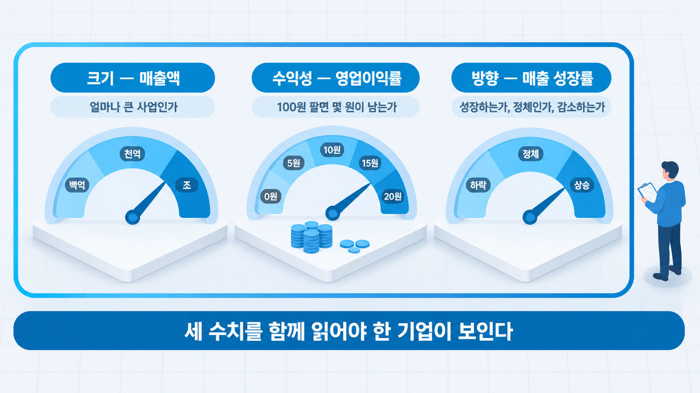
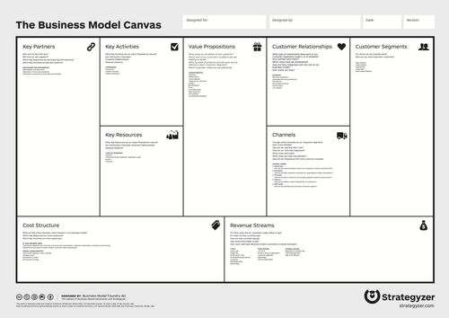
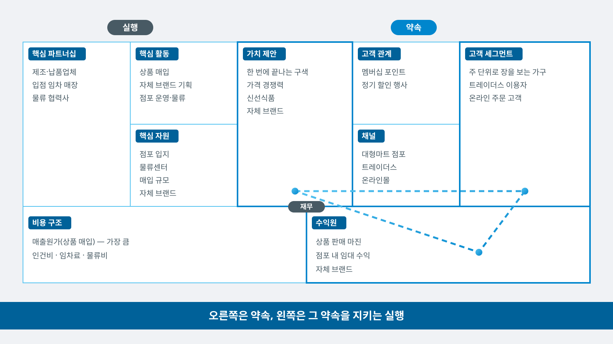
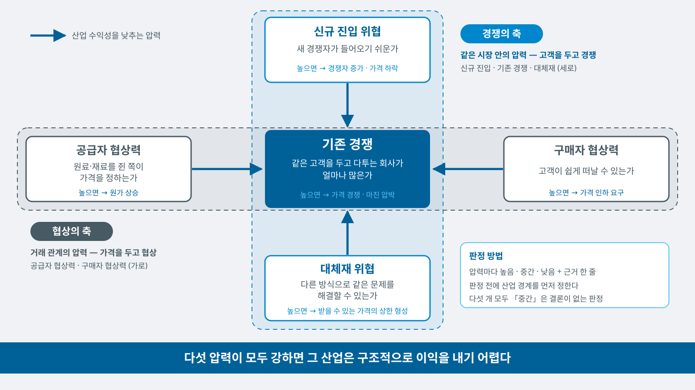
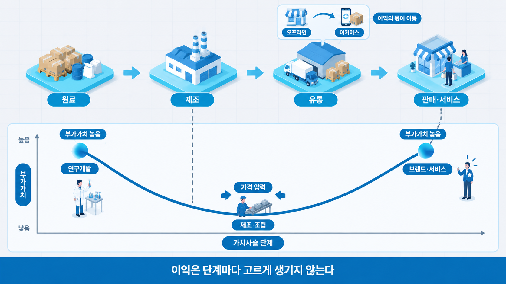
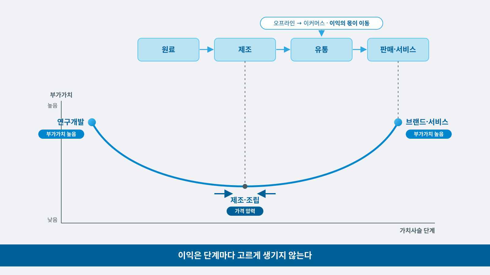

# 5주차 — 기업과 산업 읽기

> 경영경제 분야 AI 활용 입문 · 단국대학교
> **복습 기준 = 이 자료 + 수업 중 필기**

## 목차

- [1. 이번 주 개요 및 목표](#1-이번-주-개요-및-목표)
- [2. 기업 정보의 원천과 재무 하이라이트](#2-기업-정보의-원천과-재무-하이라이트)
- [3. 실습 1\~3 — 같은 기업의 재무 수치를 공시와 대조](#3-실습-13--같은-기업의-재무-수치를-공시와-대조)
- [4. BMC와 Five Forces — 기업의 수익 구조와 산업의 압력](#4-bmc와-five-forces--기업의-수익-구조와-산업의-압력)
- [5. 실습 4\~6 — 수익 구조와 산업 압력의 검증](#5-실습-46--수익-구조와-산업-압력의-검증)
- [6. 심화·확장 — 가치사슬과 산업의 단계](#6-심화확장--가치사슬과-산업의-단계)
- [7. 요약과 AI 지문 비판](#7-요약과-ai-지문-비판)
- [개정 이력](#개정-이력)

---

## 1. 이번 주 개요 및 목표

### 1.1 이번 주 학습 목표

1. 기업 공개 정보의 원천(공시·IR(Investor Relations, 기업설명활동)·뉴스)의 위상 차이를 구분하고, DART에서 필요한 정보를 찾는다.
2. 재무 하이라이트 3종(매출·영업이익률·성장률)으로 기업의 크기·수익성·방향을 읽는다.
3. BMC(Business Model Canvas, 비즈니스 모델 캔버스) 9블록으로 기존 기업의 수익 구조를 분해한다.
4. 산업 구조를 보는 눈(Five Forces)을 개요 수준으로 갖춘다 — 가치사슬 관점은 자습 자료로 확인한다.
5. 소스 고정형 도구(Gemini Notebook)의 답변이 일반 챗봇의 답변과 어떻게 다른지 구분한다.
6. AI 답변의 재무 수치와 BMC 항목을 DART 사업보고서와 직접 대조해 일치·불일치와 그 원인을 기록한다.

지난주에 시장의 크기를 읽었다면, 오늘은 **그 시장 안의 기업**을 읽습니다. 기업이 스스로 공개한 자료에서 출발해, 세 개의 수치로 상태를 읽고, 아홉 개의 칸으로 수익 구조를 분해합니다. 오늘 AI 도구도 하나 늘어납니다 — 소스 고정형 도구 Gemini Notebook(구 NotebookLM)입니다.

### 1.2 이번 주 진행 순서

오늘은 설명과 실습이 번갈아 진행됩니다. **절 번호가 곧 진행 순서**입니다.

| 절 | 내용 |
|:--:|------|
| §2 | 기업 정보의 세 원천 · DART · 재무 하이라이트 3종 · 이마트 함께 읽기 |
| **§3** | **실습 1\~3** — 같은 기업의 재무 수치를 공시와 대조 |
| §4 | 비즈니스 모델 · BMC 9블록 · 이마트 함께 채우기 · Gemini Notebook · Five Forces |
| **§5** | **실습 4\~6** — 수익 구조와 산업 압력의 검증 → 조 결론 → 수업 종료 |

- 오늘 실습은 **6단계**로 구성되며 두 유형이 섞여 있습니다 — 〈**실습만**〉은 실행·기록·검증으로 구성됩니다. 〈**토론**〉에는 여기에 조원 간 논의와 합의가 더해집니다. 각 실습의 유형은 §3·§5의 표에 적혀 있습니다.
- **앞 실습의 결과가 다음 실습의 재료입니다.** 기록 양식에도 같은 순서로 칸이 있으니 순서대로 채웁니다.
- 조별 실습은 2\~4명이 자유롭게 조를 만들어 진행합니다. 한 사람이 **기록 양식의 사본**을 만들어 조원과 공유합니다 — [5주 기록 양식 사본 만들기](https://docs.google.com/document/d/1NmFRJKs-YeQLzvDJSOFwNL4q0qPiG8b9cCoMDEV-pQE/copy) (저장소 첫 화면 README에도 있습니다).
- 조원은 각자 기록한 문서를 수업 후 **PDF로 내려받아** e-campus에 제출합니다. 파일명은 `5주_이름1_이름2_이름3.pdf`, 마감은 오늘 23:59입니다.

**과제 1 관련 질문**도 지금 받습니다 — 주제 선정·범위·3종 비교에서 막히는 지점이 있으면 질문해 주세요 (제출: 6주).

---

## 2. 기업 정보의 원천과 재무 하이라이트

**학습목표**

- 공시·IR·뉴스의 위상 차이를 설명하고 정보의 신뢰 순위를 매길 수 있다.
- 매출·영업이익률·성장률로 기업의 크기·수익성·방향을 한 줄로 진단할 수 있다.

### 2.1 기업 정보의 세 원천 — 위상이 다르다

기업에 관한 정보는 어디서 오는가에 따라 무게가 다릅니다. 4주의 출처 신뢰 순위(공공 통계 > 리포트 > 기사)의 기업판입니다.

| 원천 | 성격 | 위상 |
|------|------|------|
| **공시** (DART 전자공시) | 법이 정한 의무 보고 — 허위 기재 시 **법적 책임** | 가장 무거움 — 검증의 기준점 |
| **IR 자료** (기업 홈페이지) | 기업이 투자자에게 하는 설명 — 사실 기반이지만 **유리하게 구성** | 공시로 교차 확인 |
| **뉴스·기사** | 위 둘의 재인용 + 해석 | 원출처 확인 필요(4주) |

핵심은 첫 행입니다 — **공시는 틀리게 쓰면 처벌받는 정보**입니다. 그래서 AI 답변의 기업 수치를 검증할 때 최종 대조 기준은 언제나 공시가 됩니다.

둘째 행의 요점도 함께 정리합니다 — 기업은 IR 자료에 거짓을 기재하지는 않지만, **무엇을 제시할지 선택할 수 있습니다**. 좋은 분기를 크게, 부진한 부문을 작게 배치하는 식입니다. 그래서 IR에서 인상을 얻고 공시에서 사실을 확인하는 순서가 안전합니다. 셋째 행의 뉴스는 4주에서 배운 그대로입니다 — 기사 날짜와 수치의 기준 연도가 다를 수 있고, 원출처(대부분 공시나 IR)를 확인해야 인용할 수 있습니다.

### 2.2 DART — 공시 조회의 출발점

DART(dart.fss.or.kr — 금융감독원 전자공시시스템)는 상장기업·주요 비상장기업의 공시가 모이는 곳입니다. 화면 사용법은 세 단계면 충분합니다.

1. 첫 화면 검색창에 **회사명 입력** → 회사 선택
2. 공시 목록에서 **정기공시** 유형의 **사업보고서**(연 1회)·분기·반기보고서 선택
3. 보고서 왼쪽 목차에서 필요한 절로 이동 — 「**회사의 개요**」(무슨 회사인가), 「**사업의 내용**」(무엇으로 수익을 내는가 — 오늘 4절의 원료), 「**재무에 관한 사항**」(수치)

사업보고서는 수백 쪽이지만 전부 읽는 문서가 아닙니다 — **필요한 절만 찾아 읽는 문서**이고, 2주에서 배운 분할 원칙(긴 문서는 필요한 장만)이 여기에 그대로 적용됩니다. 오늘 4.4와 시연 자료(§5)에서는 이 긴 문서를 AI 도구로 다루는 새로운 방법도 함께 확인합니다.

세 절 중 특히 「**사업의 내용**」을 기억해 두시기 바랍니다 — 회사가 자사의 사업 구조(부문·제품·시장·경쟁 현황)를 스스로 서술한 절로, 오늘 4절에서 할 수익 구조 분해의 1차 원료입니다. 기업 분석 과제(트랙 A)에서 가장 오래 머물게 될 절이기도 합니다.

### 2.3 재무 하이라이트 3종 — 크기·수익성·방향

재무제표 전체를 읽는 것은 이 과목의 범위가 아닙니다. 대신 **세 수치만으로 기업의 상태를 한 줄로 진단**하는 법을 익힙니다.

| 수치 | 읽는 것 | 읽는 요점 |
|------|--------|------|
| **매출액** | 기업의 **크기** | 얼마나 큰 사업인가 (조·천억·백억 — 자릿수부터) |
| **영업이익률** (영업이익 ÷ 매출액) | 기업의 **수익성** | 100원 팔면 몇 원이 남는가 |
| **매출 성장률** (전년 대비) | 기업의 **방향** | 커지는 중인가, 정체인가, 줄어드는 중인가 |

세 수치는 각각 다른 질문에 답하므로 **하나만 보면 오독**합니다 — 매출이 커도 이익률이 낮으면 박리다매 구조이고, 이익률이 높아도 성장률이 꺾였다면 성숙한 사업입니다. 4주 보충의 "성장률은 규모와 함께"가 기업 읽기에서도 반복됩니다.

영업이익률에는 판단 기준이 하나 더 있습니다 — **업종마다 정상 범위가 다릅니다.** 상품을 매입해 되파는 업종은 매출원가 비중이 커서 이익률이 낮게 나오고, 원가 구조가 다른 업종은 같은 이익률이라도 평가가 달라집니다. 따라서 **이익률은 절대값이 아니라 같은 업종 안에서 비교**해야 의미가 생깁니다(6.2 함께 짚어보기에서 연습).

성장률은 4주 보충의 원칙을 그대로 적용합니다 — 한 해의 급등·급락은 일시 요인(대형 계약·일회성 비용)일 수 있으므로, **가능하면 3개년 추이**로 확인합니다. 사업보고서에는 보통 3개년 수치가 나란히 실려 있어 이 확인이 어렵지 않습니다.

용어 하나를 미리 구분해 둡니다 — 보고서에는 영업이익 외에 **당기순이익**도 나옵니다. 영업이익은 본업에서 남긴 이익이고, 순이익은 이자·세금·일회성 손익까지 전부 반영한 최종 결과입니다. 이 과목은 **사업 구조를 읽는 것이 목적이므로 본업의 성적표인 영업이익**을 기준으로 삼습니다.



### 2.4 실제 기업 수치 함께 읽기

최근 공시된 실제 기업 한 곳의 세 수치를 함께 읽고, "이 회사는 지금 어떤 상태인가"를 한 줄로 진단합니다.

**대상 기업 — 이마트** (2025년 사업보고서 · 2026년 반기보고서, DART 정기공시)

| 수치 | 2025년 값 (연결 기준) | 읽기 |
|------|------|------|
| **매출액**(순매출) | **28조 9,704억 원** | 크기 — 조 단위, 국내 유통업 최상위권 |
| **영업이익 → 영업이익률** | 3,225억 원 → **약 1.1%** | 수익성 — 100원 팔아 1원 남는 구조. 상품을 매입해 되파는 업종이므로 이익률이 낮게 나옴(2.3) |
| **매출 성장률** | **−0.2%** (전년 대비) | 방향 — 정체 |

세 수치만 놓고 한 줄 진단을 먼저 만듭니다. "규모는 크지만 이익률이 낮고 매출이 정체된 회사"가 한 답이 됩니다.

그런데 같은 보고서에서 **별도 기준**을 보면 다른 그림이 나옵니다 — 총매출 17조 9,660억 원(+5.9%), 영업이익 2,771억 원(**+127.5%**). 연결 기준은 자회사 실적을 합산한 값이고(2025년에는 건설 자회사의 손실이 포함됐습니다), 별도 기준은 이마트 한 회사만의 값입니다.

진단 문장이 "정체"에서 "본업은 개선 중"으로 달라지는 지점이며, **어느 기준의 수치인지 확인하지 않으면 같은 회사를 두고 정반대 진단이 나올 수 있습니다.** 2026년 상반기도 같은 구조입니다 — 연결 순매출은 1.5% 줄었지만 별도 영업이익은 15.4% 늘었습니다.

*(출처: 이마트 2025년 연간 실적 공시 2026-02-11 · 2026년 2분기 실적 공시 2026-08-13 — 신세계그룹 뉴스룸 / DART 사업보고서·반기보고서)*

### 2.5 함께 짚어보기 — 어느 회사가 "좋은 회사"인가

**Q**: A사는 매출 10조 원·영업이익률 3%, B사는 매출 5천억 원·영업이익률 20%입니다. 어느 쪽이 더 좋은 회사일까요?

**A**: 질문 자체가 불완전합니다 — **"무엇에 좋은가"가 빠져 있기 때문**입니다. 규모의 안정성·고용·시장 지배력을 본다면 A사가, 수익 구조의 효율을 본다면 B사가 앞섭니다. 업종이 다르면 비교 자체가 성립하지 않을 수도 있습니다.

수치는 판단을 대신해 주지 않으며, **어느 수치를 볼지는 판단의 목적에 따라 달라집니다** — 3주 구상의 주도권이 기업 읽기에서도 반복되는 지점입니다.

과제 보고서의 진단 문장에도 같은 원칙이 적용됩니다 — "좋은 회사다"가 아니라 "**어떤 기준으로 보면 어떤 상태다**"로 씁니다.

---

## 3. 실습 1\~3 — 같은 기업의 재무 수치를 공시와 대조

**학습목표**

- 조원과 대상 기업을 정하고 같은 질문을 동시에 실행해 응답의 차이를 비교할 수 있다.
- AI가 제시한 재무 수치를 DART 공시와 직접 대조해 일치·불일치를 판정할 수 있다.
- 대조 결과를 근거로 기업의 상태를 수치의 기준과 함께 한 줄로 진단할 수 있다.

### 3.1 진행 방식과 조 편성

**준비 (3분)**

1. 2\~4명이 조를 만듭니다. 조장은 없습니다.
2. 조원 1인이 기록 양식 사본을 만들어 나머지 조원에게 **편집 권한으로 공유**합니다. 조원 명단(이름·학번)을 채웁니다.
3. 조가 함께 **대상 기업 1곳**을 정합니다 — 과제 1 주제와 관련된 기업(트랙 A = 분석 대상 / 트랙 B = 경쟁·유사 기업).
   - ⚠️ **상장기업으로 정합니다** — 실습 3에서 DART 공시와 대조해야 하므로 공시가 있는 회사여야 합니다. 관심 기업이 비상장이면 같은 업종의 상장기업으로 대체합니다.
4. 정한 기업의 **DART 사업보고서를 미리 열어 양식의 링크 칸에 주소를 붙여 넣어 둡니다**(2.2에서 연 그 화면). 실습 3의 대조를 위한 준비입니다.

**오늘 실습의 규칙 네 가지**

- **실습 1과 실습 4에서는 조원 전원이 같은 프롬프트를 각자의 Gemini에서 동시에 실행**하고 결과를 비교합니다. 나머지 실습에서는 조원 간 비교를 하지 않고 검증에 집중합니다 — 실행 방식은 조가 정하되, **검증은 모든 실습에서 합니다.**
- 실습 사이에는 질문의 **한 요소만** 바꿉니다. 무엇을 바꿀지는 3.2와 5.4의 표에 정해져 있으나, 그 문안은 조가 작성합니다.
- **앞 실습의 결과가 다음 실습의 재료입니다.** 표의 "가져올 것" 열이 그 연결입니다. 순서를 건너뛰면 다음 실습에 가져올 것이 없습니다.
- **실행은 Gemini 앱에서 하고, 결과는 기록 양식에 붙여 넣습니다.** 조원 간 비교가 도구 차이에 좌우되지 않아야 하기 때문입니다.

각 실습이 끝나면 조원은 각자의 이름 절에 **검증 결과**를 기록하고, 실행한 조원은 **프롬프트와 응답**도 함께 기록합니다. 조는 기록표의 해당 행을 함께 채웁니다. 응답은 요약하지 않고 **AI가 출력한 문장 그대로** 붙여 넣습니다. 이 기록이 곧 AI 활용 로그입니다.

### 3.2 실습 1\~3

| 실습 | 유형 | 바꾸는 것 | 가져올 것 | 비교 관점 | **검증할 것** |
|:--:|:--:|------|------|------|------|
| 1 | 〈실습만〉 | 회사명만 — "○○의 최근 실적을 알려줘" | 대상 기업 | 조원 간 연도·수치·기준 차이 | **어느 해·연결/별도·출처**의 표기 |
| 2 | 〈실습만〉 | 재무 3종 지정 + **기준 연도·연결/별도** 명시 | 실습 1의 답 | — | 영업이익률 **직접 검산** |
| 3 | **〈토론〉** | **DART 사업보고서와 직접 대조** | 실습 2의 수치 | — | **일치·불일치·확인 불가**와 원인 |

- **실습 1** — 회사명만 입력한 질문의 답이 조원 간에 무엇에서 달라지는지 확인합니다 — 어느 해의 수치인가, 연결 기준인가 별도 기준인가, 출처가 있는가(2.4).
- **실습 2** — 재무 하이라이트 3종을 항목으로 지정하고, 기준 연도와 연결/별도 기준을 명시하도록 요구합니다(2.3·2.4). 받은 수치로 **한 줄 진단**(크기·수익성·방향)까지 만듭니다 — 2.5에서 연습한 형식입니다. 영업이익률은 영업이익 ÷ 매출액으로 그 자리에서 검산합니다.
- **실습 3** — 준비 4에서 열어 둔 사업보고서의 「재무에 관한 사항」에서 매출액·영업이익을 찾아 실습 2의 수치와 대조합니다(2.2). 어긋났다면 원인을 **연도 차이 · 연결/별도 차이 · 환각** 가운데에서 판정합니다.

- **실습 3이 오늘의 핵심입니다.** 기업 수치에는 공시라는 대조 기준이 있습니다. 검증이 가능하므로, 검증하지 않는 것은 선택의 문제입니다.
- **실습 3은 토론형입니다.** 대조를 마친 뒤 조가 함께 **한 줄 진단**을 합의해 기록표 ① 아래의 「조의 한 줄 진단」 칸에 적습니다. 진단 문장에는 근거 수치의 기준(연도 · 연결/별도)을 함께 적습니다.
- 대조 결과(일치·불일치·확인 불가)는 그대로 과제 2 검증 기록의 재료가 됩니다.

⛔ **여기까지 실습 1\~3입니다.** 기록 양식에도 같은 자리에 경계선이 있습니다. **실습 4로 넘어가지 말고** 여기서 멈춘 뒤 §4 설명을 듣습니다 — 실습 4부터는 §4에서 다룰 BMC와 Five Forces를 사용하므로, 실습 4를 먼저 수행하면 같은 작업을 두 번 하게 됩니다.

> **실습 4의 입력** — 공시로 확인한 **재무 3종(기준 연도·연결/별도 명시)과 조의 한 줄 진단**. 실습 4는 이 진단에서 시작합니다.

---

## 4. BMC와 Five Forces — 기업의 수익 구조와 산업의 압력

**학습목표**

- 비즈니스 모델이 제품 설명과 어떻게 다른지 설명할 수 있다.
- BMC 9블록의 세 영역을 구분하고, 실제 기업의 수익 구조를 블록으로 분해할 수 있다.
- 소스 고정형 도구(Gemini Notebook)와 일반 챗봇의 답변 차이를 설명할 수 있다.
- Five Forces의 다섯 질문으로 산업의 수익 환경을 판정할 수 있다.

### 4.1 비즈니스 모델 — 제품이 아니라 구조

"이 회사는 무엇을 하는 회사인가"라고 물으면 대부분 제품을 답합니다 — "커피를 파는 회사"·"검색 서비스 회사". 그런데 경영의 질문은 한 층 더 들어갑니다. **"이 회사는 무엇으로 수익을 내는가."**

비즈니스 모델은 제품 설명이 아니라 **누구에게, 어떤 가치를, 어떤 방식으로 전달하고, 그 과정에서 어떻게 수익을 내는지의 구조**입니다. 제품은 그 구조의 구성 요소 가운데 하나일 뿐입니다. 같은 커피를 팔아도 직영 매장 모델(스타벅스)과 가맹 모델(저가 프랜차이즈 — 1주 시연의 그 시장)은 수익의 원천이 다릅니다. 전자는 음료 판매가, 후자는 가맹점에 공급하는 원부자재와 가맹비가 본사 수익의 큰 축입니다.

같은 제품·다른 모델의 예를 하나 더 들면 — 정수기입니다. 판매 모델은 한 번에 대금을 받고 끝나지만, 렌털 모델은 월 이용료와 정기 관리로 **반복 수익**을 만듭니다.

국내 정수기 시장이 렌털 중심으로 재편된 것은 제품이 바뀌어서가 아니라 **수익 구조의 선택이 바뀌었기 때문**입니다. 제품만 보면 이 차이가 확인되지 않고, 구조를 봐야 확인됩니다. *(출처: 렌털 방식은 1998년 코웨이가 업계 최초 도입, 이후 렌털 계정 기준 시장 성장 — 전자신문 2021-04-01·서울신문 2020-08-14 보도)*

좋은 비즈니스 모델의 판별 기준으로 널리 쓰이는 두 가지 시험이 있습니다(Magretta, 2002).

- **이야기 시험**: 누가 왜 이 회사에 돈을 내는지가 말이 되는가
- **수치 시험**: 그 이야기대로 계산했을 때 수지가 맞는가

이야기는 그럴듯하지만 계산이 맞지 않으면 팔수록 손해가 나고, 계산은 맞지만 이야기가 어색하면 애초에 고객이 구매하지 않습니다 — 둘 다 통과해야 사업이 성립합니다.

이 두 시험은 AI 활용의 분업 지점이기도 합니다 — 생성형 AI는 **이야기를 유창하게 만드는 데 강하고**, 그래서 이야기 시험을 통과한 것처럼 보이는 문장을 쉽게 내놓습니다. 반면 수치 시험(고객 수 × 지불 금액이 비용을 감당하는가)은 AI의 약점 영역이므로(2주 — 계산 취약) **사람이 직접 검산**합니다. 유창한 사업 설명일수록 수치 시험부터 적용하는 습관이 필요합니다.

### 4.2 BMC 9블록 — 세 영역으로 읽기

BMC(Osterwalder & Pigneur, 2010)는 이 구조를 아홉 칸에 나눠 담는 표준 판입니다. 아홉 칸은 세 영역으로 묶어 읽으면 쉽습니다.



*(그림 출처: The Business Model Canvas — Strategyzer AG(strategyzer.com) · CC BY-SA 3.0)*

| 영역 | 블록 | 답하는 것 |
|------|------|----------|
| **고객 측** (오른쪽) | 고객 세그먼트 · 가치 제안 · 채널 · 고객 관계 | 누구에게 무엇을 어떻게 전하는가 |
| **인프라 측** (왼쪽) | 핵심 자원 · 핵심 활동 · 핵심 파트너십 | 그것을 만들려면 무엇이 필요한가 |
| **재무** (아래) | 수익원 · 비용 구조 | 돈이 들어오고 나가는 구조는 어떤가 |

아홉 칸 각각을 질문 하나로 요약하면 다음과 같습니다.

| 블록 | 질문 |
|------|------|
| 고객 세그먼트 | 누가 고객인가 |
| 가치 제안 | 고객에게 무엇이 좋아지는가 |
| 채널 | 어떤 경로로 닿는가 |
| 고객 관계 | 어떻게 관계를 유지하는가 |
| 수익원 | 무엇의 대가로 돈이 들어오는가 |
| 핵심 자원 | 무엇을 가지고 있어야 하는가 |
| 핵심 활동 | 무엇을 계속 해야 하는가 |
| 핵심 파트너십 | 누구와 협력하는가 |
| 비용 구조 | 돈이 어디로 나가는가 |

**고객 측 네 칸 — 누구에게 무엇을 어떻게 전하는가**

| 블록 | 적는 것 | 주의할 점 |
|------|------|------|
| 고객 세그먼트 | 같은 필요를 가진 고객 집단 · B2C(기업–소비자)·B2B(기업 간)·양면 구조 | 「모든 사람」은 고객 정의가 아님 |
| 가치 제안 | 고객이 얻는 결과 · 다른 대안보다 나은 이유 | 기능·사양의 나열은 가치 제안이 아님 |
| 채널 | 인지 → 평가 → 구매 → 전달 → 사후 지원의 경로 | 구매 이후 단계까지 포함 |
| 고객 관계 | 개인 지원 · 셀프서비스 · 자동화 · 커뮤니티 | 성장 단계에 따라 유형이 달라짐 |

가치 제안은 고객이 얻는 결과로 적습니다. 「더 빠른 배송」보다 「배송 시간을 예측할 수 있어 재고 부담이 줄어든다」가 고객 관점의 표현입니다(고객이 해결하려는 일은 7주).

구매를 결정하는 사람과 실제로 사용하는 사람이 다를 수도 있습니다. 병원 의료기기라면 구매 결정자는 행정 책임자, 사용자는 의사·간호사이므로 두 집단에 제시할 가치가 다릅니다.

**인프라 측 세 칸 — 약속을 지키려면 무엇이 필요한가**

| 블록 | 적는 것 | 예 |
|------|------|------|
| 핵심 자원 | 없으면 모델이 작동하지 않는 자산 — 물적·무형·인적·재무 | 매장·설비 / 특허·브랜드·데이터 / 핵심 인력 / 자본 |
| 핵심 활동 | 가치 제안을 실현하려고 반드시 수행하는 활동 | 상품 매입·물류(유통 기업) / 모델 학습(AI 기업) |
| 핵심 파트너십 | 외부 기업이 수행하는 활동과 자원 · 협력 관계 | 공급 계약 · 전략적 제휴 · 합작 |

세 칸의 내용은 고객 측의 약속에서 결정됩니다. 어떤 활동을 직접 수행하고 어떤 활동을 파트너가 담당할지가 이 영역의 핵심 판단입니다. 모든 역량을 내부에 갖춘 기업은 드뭅니다.

**재무 두 칸 — 수익과 비용의 구조**

- **수익원** — 각 고객 세그먼트가 가치 제안의 대가로 지불하는 금액입니다. 한 번 받고 끝나는 **일회성 수익**(제품 판매)과 계속 발생하는 **반복 수익**(구독·임대·라이선스·수수료)으로 구분합니다(유형 목록은 6.3 보충).
- **비용 구조** — 모델을 운영하는 데 드는 비용입니다. 판매량과 무관한 **고정비**와 판매량에 비례해 증가하는 **변동비**의 비중을 먼저 확인합니다.
- 고정비 비중이 큰 사업은 판매량이 늘수록 단위당 비용이 낮아집니다(**규모의 경제**). 고객 1명을 추가하는 비용이 0에 가까운 소프트웨어 사업이 대표적입니다.
- 매출원가(상품 매입)가 비용의 대부분인 유통업은 판매량이 늘어도 비용 비율이 크게 낮아지지 않습니다. 4.3에서 확인하는 이마트의 낮은 영업이익률과 이어지는 구조입니다.

기억할 원리는 하나입니다 — **오른쪽이 약속, 왼쪽이 그 약속을 지키는 실행**입니다. 고객에게 무엇을 약속했는지(오른쪽)가 정해져야 무엇을 갖춰야 하는지(왼쪽)가 따라 나오고, 두 쪽의 결과가 재무(아래)에 모입니다.

기존 기업을 **읽을 때**의 방법은 수익원 칸에서 출발하는 것입니다 — "이 돈은 누가, 무엇 때문에 내는가"를 거슬러 확인하면 구조가 빠르게 드러납니다.

아홉 칸이 서로 맞물려 있어서, 고객 칸과 수익원 칸을 나란히 놓으면 모순이 확인됩니다 — "예산이 부족한 고객"과 "고액 연간 구독료"를 같은 판에 적는 순간 어긋남이 드러나는 식입니다.

**채우는 순서 — 새로 만들 때는 고객부터**

새 사업의 캔버스는 고객 측에서 인프라 측으로 채웁니다.

**고객 세그먼트 → 가치 제안 → 채널 → 고객 관계 → 수익원 → 핵심 자원 → 핵심 활동 → 핵심 파트너십 → 비용 구조**

고객이 정해져야 제공할 가치가 정해집니다. 가치가 정해져야 전달 경로와 받을 대가가 정해집니다. 그다음에 필요한 자원·활동·파트너가 결정되며, 비용 구조는 앞의 여덟 칸에서 도출되는 결과입니다.

인프라 측부터 채우면 보유한 자원과 하고 싶은 활동을 먼저 적게 되어, 고객을 나중에 끼워 맞추게 됩니다. 기술 기업에서 자주 발생하는 오류입니다. 기존 기업을 읽을 때 수익원 칸에서 출발하는 것과는 방향이 반대입니다.

**다 채운 뒤의 정합성 검산 — 두 흐름**

아홉 칸을 따로따로 채우면 서로 연결되지 않은 메모 아홉 개에 그칩니다. 다 채운 뒤에는 두 흐름을 따라 칸이 이어지는지 확인합니다.

| 흐름 | 칸 | 확인할 것 |
|------|------|------|
| 약속의 흐름 | 고객 세그먼트 → 채널 → 수익원 | 이 고객에게 이 경로로 닿는가 · 이 금액을 지불할 수 있는가 |
| 실행의 흐름 | 가치 제안 → 핵심 활동 → 핵심 자원 → 비용 구조 | 약속한 가치를 만들 활동·자원이 있는가 · 그 비용이 반영되었는가 |

**정합성 검산 — 세 칸의 삼각형**

두 흐름이 만나는 **고객 세그먼트 · 가치 제안 · 수익원**이 삼각형을 이룹니다. "[고객]이 [가치] 때문에 [수익원]을 낸다"가 한 문장으로 성립하지 않으면, 나머지 여섯 칸이 정밀해도 모델이 성립하지 않습니다.

이 한 문장 검산이 4.1의 첫 번째 시험입니다. 그 금액에 예상 고객 수를 곱해 비용 구조와 견주는 것이 두 번째 시험(수치 시험)입니다.

AI에게 받은 BMC 초안에도 이 한 문장 검산을 가장 먼저 적용합니다(7.2 문항 2에서 연습).

### 4.3 함께 채우기 — 이마트의 9블록

기존 기업의 구조를 **읽는 도구**로 BMC를 사용합니다. 대상은 2.4에서 수치로 읽은 **이마트**입니다 — 같은 회사를 수치와 구조 두 방식으로 읽어 보는 것이 오늘의 설계입니다.

| 블록 | 이마트 (함께 채우기) |
|------|----------------------|
| 고객 세그먼트 | 주 단위로 장을 보는 가구·창고형 할인점(트레이더스) 이용자·온라인 주문 고객 |
| 가치 제안 | 한 번에 끝나는 구색 + 가격 경쟁력 + 신선식품 + 자체 브랜드(노브랜드·피코크) |
| 채널 | 전국 대형마트 점포·트레이더스·온라인몰 |
| 고객 관계 | 멤버십 포인트·정기 할인 행사 |
| 수익원 | 상품 판매 마진 + **점포 내 임대 수익** + 자체 브랜드 |
| 핵심 자원 | 점포 입지·물류센터·매입 규모(바잉파워)·자체 브랜드 |
| 핵심 활동 | 상품 매입·자체 브랜드 기획·점포 운영·물류 |
| 핵심 파트너십 | 제조·납품업체·입점 임차 매장·물류 협력사 |
| 비용 구조 | **매출원가(상품 매입)가 가장 크고** 인건비·임차료·물류비가 뒤따름 |

채우면서 확인되는 것 — 물건을 파는 회사로 보이지만, 구조로 읽으면 **매입가와 판매가의 차이로 대규모 고정비를 감당하는 모델**입니다. 2절에서 확인한 영업이익률이 한 자릿수 초반인 이유가 비용 구조 칸에 이미 들어 있습니다 — 매출원가 비중이 크면 남는 비율이 작아집니다.

수익원 칸의 **임대 수익**도 눈여겨볼 항목입니다 — 점포에 들어온 임차 매장에서 받는 수익은 상품을 팔지 않아도 들어오는 돈이며, 점포를 "판매 장소"가 아니라 "집객 자산"으로 다루는 관점이 드러납니다. 사소해 보이는 칸 하나에서도 이렇게 구조가 확인됩니다.

한 가지 관점을 덧붙이면 — 기존 기업의 BMC는 **사실의 기록**이지만, 새 사업의 BMC는 칸마다 **검증되지 않은 가설**입니다. 같은 판이 13주(아이디어 검증)에서는 검증 도구로 다시 등장합니다. 오늘은 "읽는 도구", 13주는 "만드는 도구"입니다.



**AI 응답에서 확인한 예 — 가치 제안 칸**

학교 계정 Gemini에 실습 4의 예시 질문(이마트 BMC 네 칸)을 입력해 받은 응답 가운데 가치 제안 칸의 한 줄입니다.

> 신선식품 및 킬러 카테고리 경쟁력: 직매입 및 스마트 물류 인프라를 통한 최상급 신선식품 공급

- 「최상급 신선식품」은 고객이 얻는 결과입니다. 「직매입 및 스마트 물류 인프라」는 그 결과를 만드는 **수단**이므로 핵심 활동·핵심 자원 칸에 적습니다.
- 실습 4의 검증 항목 「가치 제안 칸에 기술·사양이 포함되었는가」가 확인하는 대상이 이 경계입니다.

*(출처: 학교 계정 Gemini 3.6 Flash 응답 · 2026-10-08 · 응답은 실행마다 달라질 수 있음)*

### 4.4 Gemini Notebook(구 NotebookLM) — 소스에 고정된 답변

오늘의 새 도구입니다. Gemini Notebook(2026년 7월까지의 이름은 NotebookLM — 주소 notebooklm.google은 그대로)은 **업로드한 문서만을 근거로 답하는** 소스 고정형 도구입니다. 지금까지 배운 방식들과 나란히 놓으면 세 번째 방식이 됩니다(2주 3.1 네 경로 중 세 번째).

| 방식 | 근거 | 특징 |
|------|------|------|
| 웹 지식 (기본 챗봇) | 학습 데이터 | 컷오프 이전 지식에 한정 — 2주 |
| 웹 검색 (웹 그라운딩 — RAG의 웹 형태) | 질문 시점의 웹 | 최신 반영·출처 제시 — 2주 |
| **소스 고정** (Gemini Notebook) | **업로드한 문서만** | 근거 인용 표시·문서 밖은 모름 — 오늘 |

**왜 소스를 고정하면 환각이 줄어드는가** — 2주에서 본 생성 구조로 설명됩니다.

업로드한 문서는 **컨텍스트 창**에 올라갑니다. 창 안에 있는 문장이 다음 토큰의 확률을 지배하므로, 가중치에 저장된 일반 지식 대신 **그 문서가 답의 근거**가 됩니다. 어느 부분에서 나왔는지 표시할 수 있는 것도 답이 창 안의 특정 구간에서 만들어지기 때문입니다.

한계도 같은 원인에서 나옵니다.

- **창 밖은 모릅니다** — 문서에 없는 사실은 답하지 못하며, 이것이 환각을 줄이는 장치이자 동시에 제약입니다.
- **긴 보고서가 통째로 창에 올라가지는 않습니다** — 질문과 관련된 부분만 찾아 올리는 방식이라, 근거 표시가 붙어 있어도 누락이 생길 수 있습니다. **답에 없다고 문서에 없는 것은 아닙니다.**

**2026년 7월 개편 — 이름과 기능이 함께 바뀌었습니다.** NotebookLM은 2026-07-16 Gemini Notebook으로 개명되어 Gemini 앱과 통합되었습니다. 소스 고정 답변은 이전과 같으며, 에이전틱 리서치와 코드 실행 두 가지 기능이 더해졌습니다.

| 기능 | 내용 | 이 과목에서의 자리 |
|------|------|------|
| 소스 고정 답변 · 근거 인용 | 업로드한 문서만을 근거로 답하고 어느 부분에서 왔는지 표시 | 5.1\~5.3 시연 자료(실행 기록 추가 예정) · 학생 직접 사용 12주 |
| 에이전틱 리서치 | 업로드한 자료를 정리·분석해 보고서 초안을 생성 | 2주 3.1 네 번째 경로 — 7주·12주 |
| 코드 실행 | 업로드한 표·데이터로 계산·분석을 수행(유료 등급부터 단계 제공) | 9주 파일 업로드 분석 |

Gemini 앱 안에서도 노트북을 만들 수 있어 접근 경로가 둘이 되었습니다. 학교 계정에서는 Gemini 앱 왼쪽의 「노트북」과 Gemini Notebook 사이트 두 경로가 모두 열립니다(2026-10-07 확인). *(출처: Google 제품 안내 2026-07-16 — Chrome Story 보도)*

### 4.5 Five Forces — 산업의 수익성을 묻는 다섯 질문

기업을 읽었다면, 그 기업이 서 있는 **산업**도 한 번 봐야 합니다. Porter의 Five Forces는 산업의 수익 환경을 다섯 압력으로 개관하는 도구입니다 — 이 과목에서는 개요 수준으로, **다섯 개의 질문**으로 기억합니다.

| 압력 | 질문 |
|------|------|
| 기존 경쟁 | 같은 고객을 두고 다투는 회사가 얼마나 많은가 |
| 신규 진입 | 새 경쟁자가 들어오기 쉬운가 |
| 대체재 | 다른 방식으로 같은 문제를 해결할 수 있는가 |
| 공급자 협상력 | 원료·재료를 쥔 쪽이 가격을 정하는가 |
| 구매자 협상력 | 고객이 쉽게 떠날 수 있는가 |

**기원과 구조 — 수익성을 정하는 산업 구조**

이 도구는 Michael Porter가 1979년 『하버드 비즈니스 리뷰』에 발표한 논문 「How Competitive Forces Shape Strategy」에서 제시했습니다.

핵심 명제에 따르면 기업의 수익성은 **그 기업이 얼마나 잘하느냐보다 어떤 산업에 속해 있느냐에 더 크게 좌우됩니다.** 다섯 압력이 모두 강하면 그 산업은 구조적으로 이익을 내기 어렵고, 약하면 상대적으로 수월합니다.

다섯 압력은 두 종류로 구분됩니다.

| 구분 | 압력 |
|------|------|
| 같은 시장 안의 압력 | 기존 경쟁 · 신규 진입 · 대체재 |
| 거래 관계의 압력 | 공급자 협상력 · 구매자 협상력 |

**Five Forces 구조 — 경쟁의 축과 협상의 축**



**무엇이 압력을 높이는가**

| 압력 | 압력이 높아지는 조건 | 사업에 미치는 영향 |
|------|------|------|
| 기존 경쟁 | 경쟁자 다수·규모 비슷 · 성장 정체 · 고정비 비중 큼 · 차별화 낮음 | 가격 경쟁·마진 압박 |
| 신규 진입 | 진입 장벽이 낮음(아래 여섯 가지) | 경쟁자 증가·가격 하락 |
| 대체재 | 다른 방식의 가격 대비 성능이 우수함 · 전환 비용 낮음 | 받을 수 있는 가격의 상한 형성 |
| 공급자 협상력 | 공급자가 소수 · 대체 공급원 없음 · 핵심 기술·특허 보유 | 원가 상승 |
| 구매자 협상력 | 소수의 대형 구매자 · 전환 비용 낮음 · 제품이 표준화됨 | 가격 인하 요구 |

기존 경쟁은 가격·광고·신제품 경쟁처럼 가장 직접 관찰되는 압력입니다. 스마트폰이 디지털카메라·MP3 플레이어·GPS 기기를 차례로 대체한 것처럼, 대체재는 다른 산업에서 등장하기도 합니다.

**진입 장벽 — 신규 진입 압력의 세기를 정하는 요인**

진입이 쉬울수록 기존 기업은 가격을 높이거나 효율을 낮출 여유가 없습니다. 진입의 난이도는 다음 여섯 가지 장벽으로 판단합니다.

| 장벽 | 의미 |
|------|------|
| 규모의 경제 | 기존 기업은 대량 생산으로 단위 비용이 낮아 신규 기업이 같은 가격으로 경쟁하기 어려움 |
| 차별화·브랜드 | 고객이 기존 브랜드를 신뢰해 새 브랜드로 옮기지 않음 |
| 전환 비용 | 고객이 공급자를 바꾸는 데 드는 시간·비용·위험 |
| 자본 요구량 | 설비·매장·재고에 필요한 초기 자금 |
| 규제·특허 | 인허가·영업 규제·특허권 |
| 유통 채널 | 기존 기업이 판매 경로를 이미 확보함 |

**빠른 적용 — 저가 커피 프랜차이즈 산업**(1주 시연의 그 시장): 진입 장벽 낮음(창업 쉬움) + 기존 경쟁 치열(브랜드 다수) + 구매자 대안 많음(편의점·홈카페) → 다섯 압력 중 셋이 강한, **구조적으로 마진이 얇은 산업**입니다. 그 안에서 본사들이 가맹 확장·원부자재 공급으로 수익을 확보하는 이유가 구조에서 읽힙니다.

4주와의 관계도 정리해 두면 — TAM이 "시장이 큰가"를 물었다면, Five Forces는 "**그 시장에서 이익이 남는가**"를 묻습니다. 크기와 수익 환경은 별개의 질문이라서, 큰 시장·얇은 마진의 조합(저가 커피가 그 예)이 얼마든지 존재합니다.

한 가지 오해도 바로잡습니다 — **경쟁은 경쟁사만이 아닙니다.** "직접 경쟁사가 없다"고 해도 대체재·신규 진입·거래 상대의 압력은 그대로 작동합니다. 트랙 B(아이디어 검증) 학생이 특히 기억할 문장입니다.

과제 적용도 단순합니다 — 트랙 A라면 분석 대상 산업에, 트랙 B라면 아이디어가 진입할 산업에 다섯 질문을 던져 **각 한 줄씩 높음·중간·낮음으로 판정하고 근거를 붙입니다.** 다섯 줄이면 보고서의 경쟁 환경 절 골격이 됩니다. 주의할 것은 다섯 개 전부를 "중간"으로 적는 회피입니다 — 차이가 없는 판정에서는 아무 결론도 나오지 않습니다.

오늘 실습 6에서 이 다섯 질문을 각 조의 대상 기업이 속한 산업에 적용합니다.

**분석 4단계 — 판정에서 위치 결정까지**

| 단계 | 작업 | 주의할 점 |
|------|------|------|
| 1. 산업 경계 설정 | 고객이 자사 대신 선택할 수 있는 대안의 범위로 설정 | 너무 넓으면 압력이 섞임 · 너무 좁으면 경쟁자가 없다는 착시 |
| 2. 압력별 판정 | 다섯 압력을 높음·중간·낮음으로 판정하고 근거 한 줄 기재 | 근거 없는 판정은 다음 단계에서 사용할 수 없음 |
| 3. 산업 수익성 종합 | 다섯 판정을 종합해 수익을 내기 좋은 산업인지 판단 | 높음이 둘 이상이면 대체로 어려운 산업 |
| 4. 위치 결정 | 가장 강한 압력 한두 개를 낮추거나 피할 위치 탐색 | 목적은 산업 묘사가 아니라 위치 결정 |

흔한 오류는 두 가지입니다. 하나는 앞에서 다룬 모두 「중간」의 회피입니다. 다른 하나는 모두 「낮음」으로 판정해 산업이 매력적이라고 주장하는 편향입니다. Five Forces는 위협을 인식하는 도구이며, 산업이 좋다는 것을 증명하는 도구가 아닙니다.

실습 6에서는 판정에 앞서 산업 경계를 조에서 먼저 합의합니다(1단계).

**Five Forces의 한계 — 함께 사용할 도구**

- **한 시점의 정지 화면** — 산업 구조가 안정적이라는 전제에서 작동하므로, 구조가 빠르게 변하는 분야에서는 설명력이 떨어집니다.
- **산업 경계의 불명확성** — 아마존처럼 소매·물류·클라우드·광고를 동시에 운영하는 기업은 하나의 산업으로 분류하기 어렵습니다.
- **네트워크 효과** — 이용자가 늘수록 가치가 증가하는 플랫폼의 강점은 다섯 압력 어디에도 직접 포함되지 않습니다.
- **보완재** — 앱 생태계처럼 함께 사용하는 제품의 풍부함이 경쟁력을 좌우하지만, 다섯 압력에는 독립 항목이 없습니다.

따라서 Five Forces는 산업 진입을 판단하는 출발 도구로 사용하고, 산업 안에서의 위치는 가치사슬(6.1)로 함께 확인합니다.

**AI 응답에서 확인한 예 — Five Forces 판정**

학교 계정 Gemini에 실습 6의 예시 질문(국내 대형마트 산업의 다섯 압력을 높음·중간·낮음으로 판정)을 입력해 받은 응답 가운데 두 행입니다.

- 대체재의 위협: 「매우 높음」 — 「쿠팡·네이버 등 이커머스의 빠른 성장과 C-커머스(알리·테무), 집 근처 SSM·편의점 등으로 인해 소비자의 채널 전환이 매우 용이함.」
- 공급자 협상력: 「낮음 \~ 중간」

확인할 점은 두 가지입니다.

- **지시한 형식** — 세 단계(높음·중간·낮음)를 요구했으나 두 압력이 그 밖의 표현으로 판정되었습니다. 조원 간 판정을 비교하려면 형식부터 통일해야 합니다.
- **산업 경계** — 이커머스를 대체재로 분류했지만, 4.3 이마트의 채널 칸에는 온라인몰이 있습니다. 이커머스를 대체재로 볼지 이마트 사업의 일부로 볼지는 1단계에서 먼저 정할 문제입니다.

*(출처: 학교 계정 Gemini 3.6 Flash 응답 · 2026-10-08 · 응답은 실행마다 달라질 수 있음)*

---

## 5. 실습 4\~6 — 수익 구조와 산업 압력의 검증

**학습목표**

- AI가 정리한 BMC 항목을 사업보고서와 대조해 근거의 유무를 판정할 수 있다.
- Five Forces의 다섯 압력을 대상 기업의 산업에 적용해 판정하고 근거를 제시할 수 있다.
- 수치와 구조 두 방식으로 읽은 결과를 조 결론 두 문항으로 정리할 수 있다.

**시작하기 전에** — 실습 4는 **실습 3에서 공시로 확인한 재무 3종과 조의 한 줄 진단**에서 출발합니다. 기록 양식의 실습 3 칸을 먼저 확인합니다.

아래 5.1\~5.3은 **Gemini Notebook 시연 자료**입니다. 수업에서 실행하지 않습니다. 지금은 프롬프트와 시연 소재만 실려 있으며, 실행 기록은 준비되는 대로 이 자리에 추가합니다. 실행 기록이 게시되어 있으면 **실습 5에서 읽고** 각 조의 BMC 대조 결과와 비교합니다. 게시되어 있지 않으면 실습 5는 사업보고서 직접 대조로 진행합니다.

### 5.1 시연 자료 ① — Gemini Notebook 첫 등장: 소스에 고정된 답변

시연 순서 — 먼저 같은 질문을 일반 Gemini에 묻고, 다음에 Gemini Notebook에 사업보고서를 업로드해 같은 질문을 합니다.

**프롬프트 원문** (① Gemini 기본 모드 → ② Gemini Notebook에 사업보고서 업로드 후 동일 질문):

```
이 회사의 주요 사업 부문과 부문별 매출 비중을 알려줘.
어떤 사업에서 수익이 나는지 구조를 정리해줘.
```

**시연 소재** — 이마트 **2025년 사업보고서** PDF(DART 정기공시, 2026년 3월 제출분). 2.4에서 함께 읽은 것과 같은 기업이므로 학생이 방금 읽은 세 수치가 이 문서 안에서 다시 나옵니다. 시연 자료 ③(5.3)의 경쟁사는 같은 유통업의 **롯데쇼핑** 사업보고서로 준비합니다.

### 5.2 시연 자료 ② — Gemini Notebook으로 BMC 항목 추출 (단계별 검증)

**프롬프트 원문** (Gemini Notebook·같은 노트북에 이어서):

```
이 사업보고서를 근거로, 이 회사의 ① 고객 ② 제공 가치
③ 수익원 ④ 주요 비용을 각각 정리해줘. 각 항목에
근거가 된 보고서 내용을 함께 표시해줘.
```

### 5.3 시연 자료 ③ — 경쟁사 보고서에 같은 질문 (구조 비교)

**프롬프트 원문** (Gemini Notebook · **롯데쇼핑 사업보고서를 업로드한 새 노트북** · 5.2와 같은 문장):

```
이 사업보고서를 근거로, 이 회사의 ① 고객 ② 제공 가치
③ 수익원 ④ 주요 비용을 각각 정리해줘. 각 항목에
근거가 된 보고서 내용을 함께 표시해줘.
```

### 5.4 실습 4\~6

§4에서 배운 BMC와 Five Forces를 실습 3의 대상 기업에 적용합니다.

| 실습 | 유형 | 바꾸는 것 | 가져올 것 | 비교 관점 | **검증할 것** |
|:--:|:--:|------|------|------|------|
| 4 | 〈실습만〉 | 질문을 구조로 전환 — **BMC 4칸** (4.2) | 실습 3의 진단 | **수익원 칸**이 조원 간 일치하는가 | 한 문장 검산 · 가치 제안의 사양 포함 여부 |
| 5 | **〈토론〉** | 수익원·주요 비용 칸을 **사업보고서와 대조** | 실습 3·4 + 「사업의 내용」 | — | 칸마다 **근거의 유무** · 비용 칸과 영업이익률 |
| 6 | **〈토론〉** | **Five Forces 판정** 요청 (4.5) | 실습 5 | — | 산업에 맞는 근거인가 · 판정의 차이 |

- **실습 4** — 요청하는 BMC 4칸은 **고객 · 제공 가치 · 수익원 · 주요 비용**입니다. 받은 답으로 "[고객]이 [가치] 때문에 [수익원]을 낸다"가 한 문장으로 성립하는지 확인하고, 가치 제안 칸에 기술·사양이 포함되었는지도 확인합니다(4.2 「정합성 검산」).
- **실습 5** — 사업보고서의 「사업의 내용」(2.2)에서 수익원과 주요 비용 칸의 근거를 찾습니다. 주요 비용 칸의 구조가 실습 3의 영업이익률 수준을 설명하는지도 확인합니다 — 4.3에서 이마트의 비용 구조로 이익률을 설명한 것과 같은 방식입니다. 5.1\~5.3의 시연 기록이 있으면 Gemini Notebook이 추출한 결과도 함께 대조합니다.
- **실습 6** — 4.5의 다섯 질문을 대상 기업이 속한 산업에 적용해 압력마다 **높음·중간·낮음**을 판정하고 한 줄 근거를 적습니다. 조원 간 판정이 달라진 압력을 찾아 근거를 비교합니다. 다섯 압력을 모두 「중간」으로 판정하지 않습니다 — 차이가 없는 판정으로는 결론을 내릴 수 없습니다.

- 실습 3이 수치를 공시와 대조했다면, **실습 5는 구조를 공시와 대조합니다** — 같은 사업보고서가 두 실습의 대조 기준입니다.
- **시간이 남는 조**는 같은 질문을 **경쟁사**에 적용해 두 회사의 구조 차이를 표로 정리합니다(5.3과 같은 방식).

### 5.5 조 결론과 제출

기록 양식의 조 결론 두 문항을 조가 함께 채웁니다.

- **"이 회사는 지금 어떤 상태인가"를 한 줄로 쓰고**(크기·수익성·방향), 그 판단의 근거가 된 수치와 **그 수치의 기준**(연도 · 연결/별도)을 함께 적는다.
- **AI 답과 공시가 어긋난 지점**은 무엇이었고, 원인은 연도 차이·기준 차이·환각 중 무엇인가. 끝까지 확인하지 못한 항목은 무엇인가.

조 결론까지 기록하면 오늘 수업을 마칩니다. 문서는 **PDF로 내려받아 조원 각자** e-campus 5주 과제란에 제출합니다 — 파일명 `5주_이름1_이름2_이름3.pdf`, 마감 오늘 23:59.

---

## 6. 심화·확장 — 가치사슬과 산업의 단계

오늘 4.5에서 다룬 Five Forces가 "그 산업에서 이익이 남는가"를 물었다면, 이 절은 "그 이익이 **어느 단계에** 쌓이는가"를 다룹니다.

**학습목표**

- 가치사슬 관점으로 "이익이 어느 단계에서 생기는가"를 설명할 수 있다.

### 6.1 가치사슬 — 이익은 어느 단계에서 생기는가

산업을 보는 두 번째 눈은 **단계**입니다. 제품이 소비자에게 닿기까지의 흐름(원료 → 제조 → 유통 → 판매·서비스)에서, 이익은 단계마다 고르게 생기지 않습니다.

대표 사례가 유통의 이동입니다 — 오프라인 유통 중심이던 시대에는 매장·상권을 쥔 쪽이 유리했지만, 이커머스 전환 이후 **물류망과 고객 데이터를 확보한 쪽으로 이익의 몫이 이동**했습니다. 같은 상품을 팔아도 어느 단계를 장악했는가에 따라 수익성이 달라진 것입니다.

이 이동의 결과는 기업의 순위 변화로도 확인됩니다 — 전통 유통 강자들이 이커머스·물류 기업에 시장 가치를 역전당한 흐름은 상품이 아니라 **단계의 재편**이 만든 결과였습니다. *(출처: 시가총액 기준 아마존이 월마트를 2015년 추월, 쿠팡이 이마트를 2021년 추월 — 한국경제 2021-10·2025-02 보도)*

이 관점의 요약판이 **스마일 커브**입니다 — 가치사슬의 양끝(연구개발·브랜드와 서비스)은 부가가치가 높고, 가운데(제조·조립)는 낮은 U자 곡선입니다. 가운데 구간은 대체가 쉬워 가격 압력을 양쪽에서 받기 때문입니다. 어느 기업의 이익률이 낮다면, 그 원인이 경영의 문제가 아니라 **서 있는 단계의 문제**일 수 있다는 해석이 가능해집니다.

가치사슬의 질문은 오늘 배운 BMC와 이어집니다 — "이 회사는 흐름의 어느 단계를 장악했는가"에 대한 답이 대개 **핵심 자원 칸**에 적혀 있습니다(물류망·브랜드·데이터·조달망). 기업 분석에서 두 도구를 함께 쓰면, BMC로는 회사 안의 구조를, 가치사슬로는 산업 안의 위치를 확인할 수 있는 상호 보완 관계가 됩니다.

**두 번째 사례 — 2026년의 AI 산업: 이익은 지금 어느 단계에 쌓이는가**

AI를 도구로 쓰는 이 과목에서, AI 산업 자체도 가치사슬로 읽을 수 있습니다. 흐름은 네 단계입니다.

| 단계 | 하는 일 | 2026년 현재의 이익 상황 |
|------|------|------|
| 반도체·장비 | AI 학습·추론용 칩과 메모리 | 공급 부족 · 협상력 최대 — 한국의 반도체 수출이 2026년 1분기 성장을 견인 |
| 클라우드·데이터센터 | 칩을 모아 연산 능력을 빌려줌 | 미국 주요 클라우드 기업의 2026년 설비투자 계획 6,300억\~6,900억 달러(전년 대비 60% 이상 증가) · 전력 부족으로 주문 적체 |
| 모델 | 생성형 AI 모델 개발 | 개발비 수억\~수십억 달러(2주) · 한국은 정부 지원 「독자 AI 파운데이션 모델」 정예팀 6곳이 개발 중 |
| 앱·서비스 | 모델 위에 만든 업무·소비자 서비스 | 진입이 쉬움 · 경쟁 치열 · 이익률 압박 |

*(출처: Futurum Group 2026 · Allianz Research 2026-03 · KDI 경제전망 2026 상반기 · 과학기술정보통신부 「독자 AI 파운데이션 모델」 정예팀 선정 2025\~2026)*

읽는 방법은 유통 사례와 같습니다. 이익이 집중된 단계는 **대체가 어렵고 공급이 부족한 단계**이며, 지금은 반도체와 연산 인프라입니다 — Five Forces(오늘 4.5)로 보면 반도체 층의 상황이 곧 앱·서비스 층에 작용하는 "공급자 협상력"입니다. 앱 층은 스마일 커브의 가운데처럼 진입이 쉬워 가격 압력을 받습니다.

다만 이 배치는 고정이 아닙니다. 연산 인프라에 매년 수천억 달러가 투입되는 것이 **거품인가, 철도·전력망 같은 장기 기반 투자인가**의 논쟁이 2026년 시장의 핵심 쟁점이며, 답에 따라 이익의 위치는 다시 이동합니다.

이 사례가 이 과목에서 갖는 의미는 둘입니다. 첫째, 수업에서 사용하는 무료 AI 도구의 비용은 이 사슬의 위쪽에서 누군가가 부담하고 있습니다 — 무료의 구조(오늘 6.3 보충 "무료 서비스")를 읽을 대상이 AI 도구 자체입니다. 둘째, 트랙 A로 AI 관련 기업을 고른 학생은 그 기업이 네 단계 중 어디에 속하는지부터 확인합니다 — 같은 "AI 기업"이라도 단계가 다르면 이익 구조가 정반대입니다.





### 6.2 함께 짚어보기 — 같은 산업, 다른 이익률

**Q**: 같은 산업의 두 기업인데 영업이익률이 3%와 15%로 다릅니다. 이 차이는 무엇을 말하고 있을까요? (오늘 배운 도구로 답해 보세요)

**A**: 두 관점에서 각각 가설이 도출됩니다 — **BMC 관점**: 수익 구조가 다를 수 있습니다(직영 vs 가맹·판매 vs 구독·단일 수익원 vs 복수). **가치사슬 관점**: 서 있는 단계가 다를 수 있습니다(제조 중심 vs 브랜드·서비스 중심).

즉 이익률 차이는 "경영을 잘한다/못한다"로 바로 건너뛸 문제가 아니라, **구조의 차이부터 확인할 문제**입니다. 두 관점을 모두 확인한 뒤에도 차이가 남는다면 그때가 경영 역량을 논할 차례이고, 이 확인 절차가 트랙 A 보고서의 분석 깊이를 정합니다.

### 6.3 보충 — 더 알아보기

- **무료 서비스는 무엇으로 수익을 내는가**
  - 포털·SNS·무료 앱의 BMC를 채워 보면 수익원 칸에 이용자가 아니라 **광고주**가 들어갑니다 — 이용자는 서비스를 받는 고객이면서 동시에 광고주에게 전달되는 "모아 놓은 주목"이기도 합니다.
  - 고객 세그먼트가 두 층(이용자·광고주)인 양면 구조로, "무료인데 어떻게 회사가 유지되는가"라는 질문의 표준 답입니다.
  - 이 구조에서는 이용자의 관심과 데이터가 사실상의 대가가 되므로, 광고형 서비스의 개인정보 이슈(12주 윤리·리스크)가 왜 구조적인 문제인지도 이 캔버스에서 확인됩니다.

- **수익 유형의 목록**
  - 기업 분석에서 자주 확인되는 수익 방식은 몇 가지로 정리됩니다 — 직판형(제품 판매 대금)·구독형(기간 이용료)·중개형(거래 수수료)·광고형(모은 주목)·소모품형(본체는 싸게, 소모품에서 반복 수익).
  - 실제 기업은 두세 유형을 섞는 경우가 많고, 관심 기업의 수익원 칸을 채울 때 이 목록이 점검표가 됩니다.
  - 새로운 수익 방식으로 보이는 사업도 대부분 이 유형들의 재조합이라는 점까지 확인하면, 낯선 기업을 마주해도 구조를 읽는 출발점이 생깁니다.

- **린캔버스 예고 — 읽는 판과 만드는 판**
  - BMC의 아홉 칸 중 네 칸을 바꾼 **린캔버스**라는 변형 판이 있습니다 — 파트너십·활동·자원·고객 관계 칸을 문제·솔루션·핵심 지표·결정적 강점으로 교체한, 아직 검증되지 않은 아이디어용 판입니다.
  - 기존 기업 분석(오늘)은 BMC, 새 아이디어 검증(13주)은 린캔버스 — 트랙 B 학생은 13주에 이 판을 직접 씁니다.

- **공시가 없는 기업을 읽는 법**
  - 관심 기업이 비상장 스타트업이라면 DART에 자료가 없거나 얇을 수 있습니다. 대체 경로는 셋입니다.
  - ① 가맹 사업이라면 공정거래위원회 **가맹사업 정보공개서**(매출·매장 수·비용 구조가 의무 공개) ② 기업 홈페이지·채용 공고(사업 부문·인력 구성의 단서) ③ 업계 리포트·투자 유치 보도(4주 신뢰 순위 적용 — 재인용 확인).
  - 공시만큼 무겁지 않으므로, 수치는 반드시 복수 출처로 교차 확인합니다.

---

## 7. 요약과 AI 지문 비판

### 7.1 오늘의 요약

- 기업 정보의 위상 = **공시(법적 책임) > IR(유리하게 구성) > 뉴스(재인용)** — 검증의 기준점은 공시(DART)
- **재무 하이라이트 3종** = 매출(크기)·영업이익률(수익성)·성장률(방향) — 하나만 보면 오독, 업종 안에서 비교
- 비즈니스 모델 = 제품이 아니라 **수익의 구조** — 이야기 시험 + 수치 시험
- **BMC 9블록** = 고객 측(약속)·인프라 측(실행)·재무 — 새로 만들 때는 고객부터 채우고, 다 채운 뒤 삼각형(고객·가치·수익원)으로 검산 · 기존 기업 읽기 도구(만들기 도구는 13주)
- **Gemini Notebook**(구 NotebookLM) = 소스 고정형 — 근거 인용이 제시되는 대신 문서 밖은 모름 · 2026-07 개편으로 에이전틱 리서치·코드 실행 추가
- 산업의 눈 = **Five Forces**(다섯 압력 — 경계 설정 → 판정 → 종합 → 위치 결정 · 한 시점의 정지 화면이라는 한계)·**가치사슬**(이익이 생기는 단계) — 2026년 AI 산업의 이익은 반도체·연산 인프라 층에 집중
- **6단계 조별 실습** — 같은 기업의 재무 수치를 **DART 공시와 직접 대조**(일치·불일치·확인 불가) → BMC 칸과 산업 압력의 근거를 사업보고서에서 확인
- 과제 1 제출: **다음 주(6주)**

### 7.2 AI 지문 비판

**문항 1** — 다음은 AI가 생성한 기업 분석 문단입니다. 문제점을 2개 이상 지적해 보세요.

> "K사는 연 매출 12조 원의 업계 1위 기업으로, 매출이 크기 때문에 수익성도 업계 최고 수준이다. 최근 공시에 따르면 영업이익은 3,500억 원이다. 성장세도 이어질 것으로 보인다."

<details>
<summary><b>문항 1 정답 및 해설 보기</b></summary>

① **크기와 수익성의 혼동** — 매출 12조·영업이익 3,500억이면 영업이익률 약 2.9%로, "수익성 업계 최고" 주장과 스스로 모순됩니다. 매출(크기)과 이익률(수익성)은 별개 수치입니다(2.3).

② **기준 없는 "업계 1위"** — 무엇 기준(매출·이용자·점유율) 1위인지, 업계의 경계가 무엇인지 없습니다(4주 집계 기준).

③ **근거 없는 방향 서술** — "성장세도 이어질 것"은 성장률 수치 없이 적힌 해석입니다(사실/해석 구분 — 4주).

**통찰**: 기업 수치가 나오면 세 수치를 나란히 놓고 서로 검산합니다 — 문장 안의 수치들끼리 모순되는 경우가 뜻밖에 많습니다.

</details>

**문항 2** — 다음은 AI가 채워 준 어느 스타트업의 BMC 일부입니다. 구조의 문제를 2개 이상 지적해 보세요.

> 고객 세그먼트: 가격에 민감한 대학생 / 가치 제안: 인공지능 기반 최첨단 알고리즘, 특허 출원 기술, 정밀 분석 엔진 / 수익원: 월 12만 원 프리미엄 구독

<details>
<summary><b>문항 2 정답 및 해설 보기</b></summary>

① **가치 제안 칸에 기술 나열** — "최첨단 알고리즘·특허·엔진"은 회사가 가진 것(핵심 자원에 가까움)이지 고객이 얻는 가치가 아닙니다. 고객에게 무엇이 좋아지는지가 없습니다.

② **고객–수익원 모순** — 가격에 민감한 대학생과 월 12만 원 구독료는 한 문장으로 이어지지 않습니다("대학생이 정밀 분석 때문에 월 12만 원을 낸다" — 이야기 시험 탈락, 4.2 검산).

③ 세 칸이 각각 그럴듯해도 **연결이 성립하지 않으면 구조가 아닙니다.**

**통찰**: AI가 채운 캔버스는 칸별로는 유창합니다 — 검증은 칸 안이 아니라 **칸 사이**에서 합니다.

</details>

---

## 개정 이력

| 날짜 | 내용 |
|:--:|------|
| 2026-10-07 | 최초 게시 |
| 2026-10-08 | 4.2 BMC 블록별 설명 · 채우는 순서 · 정합성 검산(두 흐름 · 세 칸의 삼각형) 추가 · 6.3의 「정합성 검산」을 4.2로 이동 · 4.3 · 4.5에 AI 응답 확인 예 추가 · 4.5 Five Forces의 기원과 구조 · 압력을 높이는 조건 · 진입 장벽 · 분석 4단계 · 한계 추가 · 7.1 요약 보강 · 그림 6장 추가(2.3 재무 하이라이트 · 4.2 BMC 양식 · 4.3 이마트 BMC · 4.5 Five Forces 구조 · 6.1 가치사슬 2장) |
| 2026-10-08 | 4.4 Gemini Notebook 기능 표의 시연 자료 표기를 현재 상태에 맞게 정정(실행 기록 추가 예정 · 학생 직접 사용 12주) |
| 2026-10-08 | 4.4 개편 문단의 추가 기능 수를 정정(세 가지 → 에이전틱 리서치·코드 실행 두 가지) · 학교 계정 접근 경로 확인 결과 반영(두 경로 모두 열림) · 기능 표의 「올린」 → 「업로드한」 표기 통일 |
